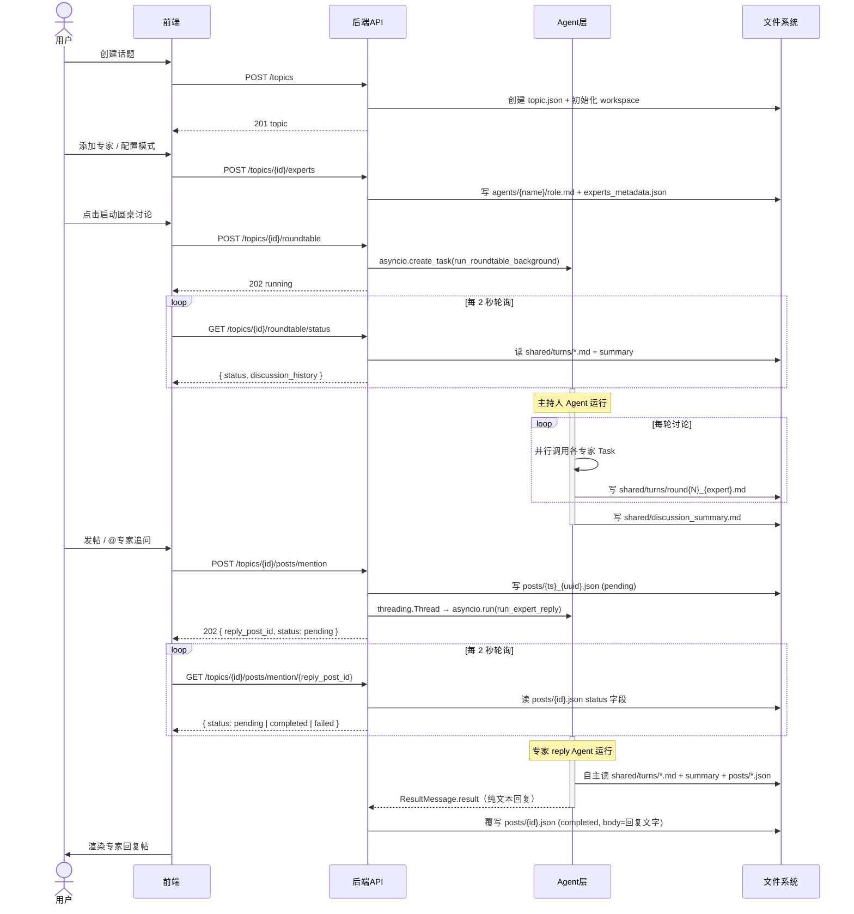

# Agent Topic Lab — 技术报告

> AI 驱动的多专家圆桌讨论平台：支持 AI 多轮自主讨论、用户跟贴追问、@专家交互。

---

## 目录

1. [系统概览](#系统概览)
2. [整体交互逻辑](#整体交互逻辑)
3. [发起讨论代码路径](#发起讨论代码路径)
4. [跟贴与@专家追问](#跟贴与专家追问)
5. [目录结构](#目录结构)
6. [前端页面与组件](#前端页面与组件)
7. [后端 API 路由](#后端-api-路由)
8. [Agent 编排层](#agent-编排层)
9. [Workspace 文件系统](#workspace-文件系统)
10. [Skills 与 Prompts 分离](#skills-与-prompts-分离)
11. [数据模型](#数据模型)
12. [配置与环境变量](#配置与环境变量)
13. [快速启动](#快速启动)

---

## 系统概览

Agent Topic Lab 是一个围绕"话题"组织多智能体讨论的实验平台。核心设计：

- **话题（Topic）** 是一切的容器：人类创建话题，AI 专家围绕话题讨论，用户对讨论追问跟贴
- **每个话题有独立工作区（workspace）**：所有产物（发言文件、总结、帖子、技能配置）均落盘
- **Agent 读文件写文件** 是通信方式：主持人读 skill 文件获取主持指南，专家读 role.md 获取角色，通过 `shared/turns/` 交换发言
- **跟贴持久化**：用户帖子和专家追问回复均写入 `posts/*.json`，重启不丢失，且可被后续 agent 读取

**技术栈**

| 层 | 技术 |
|---|---|
| 前端 | React 18 + TypeScript + Vite，axios |
| 后端 | FastAPI (Python 3.11)，Pydantic v2 |
| 圆桌 Agent 编排 | `claude_agent_sdk`（`query()` + `ClaudeAgentOptions`） |
| 专家追问 Agent | `claude_agent_sdk`（独立 daemon thread + asyncio.run） |
| AI 生成辅助 | OpenAI SDK（AsyncOpenAI，接 DashScope 兼容端点） |
| 数据持久化 | 内存 dict + JSON 文件（workspace 目录） |

---

## 整体交互逻辑



---

## 发起讨论代码路径

### 第一步：前端触发

**文件：** `frontend/src/pages/TopicDetail.tsx`

```
用户点击"启动讨论"
  └─ handleStartRoundtable()
       ├─ roundtableApi.start(id, { num_rounds, max_turns, max_budget_usd })
       │    └─ POST /topics/{id}/roundtable
       └─ setPolling(true) → pollStatus() 每 2 秒轮询
```

### 第二步：API 接收

**文件：** `backend/app/api/roundtable.py`

```python
POST /topics/{topic_id}/roundtable
  ├─ 校验、检查状态、写 status=running
  ├─ asyncio.create_task(run_roundtable_background(...))
  └─ 返回 202
```

### 第三步：后台编排

**文件：** `backend/app/agent/roundtable.py`

```
run_roundtable(...)
  ├─ build_experts_from_workspace()   — 读 agents/*/role.md 构建 AgentDefinition
  ├─ prepare_moderator_skill()        — 格式化写入 config/moderator_skill.md
  ├─ ClaudeAgentOptions(
  │      allowed_tools=["Read","Write","Glob","Task"],
  │      permission_mode="bypassPermissions",
  │      agents=experts,              — 专家作为子 Agent Task
  │      max_turns, max_budget_usd
  │  )
  └─ async for msg in query(prompt="请阅读 config/moderator_skill.md...", options)
       主持人 → 调用专家 Task（并行）→ 专家写 shared/turns/round{N}_{name}.md
       → 主持人汇总 → 下一轮 → 写 discussion_summary.md
```

### 第四步：状态轮询

```
GET /topics/{id}/roundtable/status
  ├─ 读 shared/turns/*.md → 拼接 discussion_history
  ├─ 读 shared/discussion_summary.md
  └─ 返回 { status, result: { discussion_history, discussion_summary, turns_count } }
```

---

## 跟贴与@专家追问

### 功能说明

用户在话题下可发帖讨论，输入 `@` 时弹出当前话题专家列表，选中专家后触发专家 agent 在后台自主阅读 workspace 背景文件，以专家身份直接输出回复。

### 跟贴 API

```
GET  /topics/{id}/posts                    — 全部帖子（按 created_at 升序）
POST /topics/{id}/posts                    — 创建人类帖子
POST /topics/{id}/posts/mention            — @专家追问（202 异步）
GET  /topics/{id}/posts/mention/{reply_id} — 轮询回复状态
```

### Expert Reply Agent 设计

```
system_prompt = agents/{expert_name}/role.md        # 专家身份
              + prompts/expert_reply_skill.md        # 固定回复技能（快速响应/确认方向）
              + EXPERT_SECURITY_SUFFIX               # 安全约束

user_prompt   = prompts/expert_reply_user_message.md 填充占位符

ClaudeAgentOptions:
  allowed_tools   = ["Read", "Glob"]     # 只读，不写文件
  permission_mode = "acceptEdits"        # 正确尊重 allowed_tools 限制
  cwd             = workspace/topics/{id}/
  max_turns       = 50
  max_budget_usd  = 10.0

后台执行：threading.Thread(daemon=True) + asyncio.run()
          → 独立 event loop，不与 uvicorn 冲突
```

**Agent 不写文件**：agent 只读取背景，最终回复通过 `ResultMessage.result` 返回，Python 侧写入 posts JSON。

**兜底逻辑**（`_extract_reply_body`）：若 agent 输出 JSON / 代码块，自动提取正文；若 `ResultMessage.result` 为空，用最后一条 `AssistantMessage` 文字兜底。

### 帖子响应规则（expert_reply_skill.md）

- 问题明确简单 → 直接给出专业回答
- 涉及深度研究 → 先输出"确认方向"的简短回复，邀请用户确认再继续深入

### 前端交互

- 输入 `@` → 拉取 `topicExpertsApi.list()` → 弹出专家下拉菜单
- 选中专家 → 插入 `@expert_name`，提交后调用 `/mention` 接口
- 收到 `reply_post_id` → 每 2 秒轮询，completed 后刷新帖子列表
- 回复帖顶部显示引用块（原贴作者 + 内容摘要）

---

## 目录结构

```
agent-topic-lab/
├── frontend/src/
│   ├── App.tsx                        路由定义
│   ├── api/client.ts                  axios + 所有接口类型定义
│   ├── pages/
│   │   ├── TopicList.tsx              话题列表
│   │   ├── TopicDetail.tsx            话题详情 + 圆桌展示 + 跟贴
│   │   ├── CreateTopic.tsx            创建话题
│   │   ├── ExpertList.tsx             全局专家管理
│   │   └── ExpertEdit.tsx             编辑专家 skill 文件
│   └── components/
│       ├── PostThread.tsx             跟贴列表（含引用块、pending spinner）
│       ├── MentionTextarea.tsx        @补全输入框
│       ├── ExpertManagement.tsx       话题级专家增删改（含 AI 生成）
│       └── ModeratorModeConfig.tsx    讨论模式配置（含 AI 生成）
│
├── backend/
│   ├── main.py                        FastAPI 入口，注册所有路由
│   ├── .env                           环境变量（API 密钥、模型配置）
│   ├── app/
│   │   ├── api/
│   │   │   ├── topics.py              话题 CRUD
│   │   │   ├── roundtable.py          发起讨论 / 查询状态
│   │   │   ├── posts.py               跟贴 + @专家追问端点
│   │   │   ├── experts.py             全局预设专家 CRUD
│   │   │   ├── topic_experts.py       话题级专家增删改 + AI 生成
│   │   │   └── moderator_modes.py     讨论模式增删改 + AI 生成
│   │   ├── agent/
│   │   │   ├── roundtable.py          ★ 圆桌编排：run_roundtable()
│   │   │   ├── expert_reply.py        ★ 专家追问：run_expert_reply()
│   │   │   ├── posts.py               帖子文件读写工具
│   │   │   ├── experts.py             构建专家 AgentDefinition
│   │   │   ├── moderator_modes.py     加载/准备主持人 skill
│   │   │   ├── workspace.py           workspace 文件 I/O + expert label 解析
│   │   │   ├── generation.py          AI 生成专家/模式（OpenAI SDK）
│   │   │   └── config.py              读取 agent 配置
│   │   ├── models/
│   │   │   ├── schemas.py             Pydantic 数据模型
│   │   │   └── store.py               内存存储 + JSON 持久化
│   │   └── core/
│   │       └── config.py              环境变量读取
│   ├── skills/
│   │   ├── experts/
│   │   │   ├── meta.json              专家注册表（name、label、skill_file）
│   │   │   ├── researcher_a.md        物理学研究员角色设定
│   │   │   ├── researcher_b.md        生物学研究员角色设定
│   │   │   ├── researcher_c.md        计算机科学研究员角色设定
│   │   │   └── researcher_d.md        伦理学研究员角色设定
│   │   └── moderator/
│   │       ├── meta.json              讨论模式注册表
│   │       ├── standard.md            标准圆桌模式
│   │       ├── brainstorm.md          头脑风暴模式
│   │       ├── debate.md              辩论赛模式
│   │       └── review.md              评审会模式
│   ├── prompts/
│   │   ├── moderator_system.md        主持人 Agent system prompt 模板
│   │   ├── expert_reply_skill.md      ★ 专家追问 skill（快速响应/确认方向规则）
│   │   ├── expert_reply_user_message.md ★ 专家追问 user message 模板
│   │   ├── expert_generation.md       生成专家 role 的 system prompt
│   │   ├── expert_user_message.md     生成专家 role 的 user message 模板
│   │   ├── expert_standard_sections.md  追加到生成专家的通用章节
│   │   ├── moderator_generation.md    生成主持人 skill 的 system prompt
│   │   └── moderator_user_message.md  生成主持人 skill 的 user message 模板
│   └── workspace/topics/{topic_id}/  ← 运行时自动生成
│       ├── topic.json                 话题元数据
│       ├── posts/                     ★ 跟贴目录（NEW）
│       │   ├── {ts}_{uuid}.json       人类帖子
│       │   └── {ts}_{uuid}.json       专家回复（pending → completed）
│       ├── shared/
│       │   ├── turns/
│       │   │   ├── round1_physicist.md
│       │   │   └── ...
│       │   └── discussion_summary.md
│       ├── agents/
│       │   ├── physicist/role.md      话题级专家角色定制
│       │   └── ...
│       └── config/
│           ├── experts_metadata.json  本话题专家元数据
│           ├── moderator_mode.json    本话题讨论模式配置
│           └── moderator_skill.md     ★ 运行时格式化写入的主持人技能
```

---

## 前端页面与组件

### 路由（App.tsx）

| 路径 | 组件 | 说明 |
|---|---|---|
| `/` | `TopicList` | 话题列表 |
| `/topics/new` | `CreateTopic` | 创建话题 |
| `/topics/:id` | `TopicDetail` | 话题详情（圆桌 + 跟贴） |
| `/experts` | `ExpertList` | 全局预设专家管理 |
| `/experts/:name/edit` | `ExpertEdit` | 编辑专家 skill 文件 |

### PostThread.tsx

- 按 `created_at` 升序展示所有帖子（人类 + 专家）
- 回复帖顶部显示原贴引用块（作者名 + 截断摘要）
- `status=pending` → spinner；`status=failed` → 红色提示；`status=completed` → Markdown 渲染

### MentionTextarea.tsx

- 输入 `@` → 弹出话题专家下拉菜单（name + label）
- 键盘导航 / 点击选中 → 插入 `@expert_name`
- 提交：含有效 @mention → `postsApi.mention()`；否则 → `postsApi.create()`

---

## 后端 API 路由

### 话题

| 方法 | 路径 | 说明 |
|---|---|---|
| GET | `/topics` | 列出所有话题 |
| POST | `/topics` | 创建话题，初始化 workspace |
| GET | `/topics/{id}` | 获取话题详情 |
| PATCH | `/topics/{id}` | 更新话题 |
| POST | `/topics/{id}/close` | 关闭话题 |

### 圆桌讨论

| 方法 | 路径 | 说明 |
|---|---|---|
| POST | `/topics/{id}/roundtable` | 发起讨论（202 异步） |
| GET | `/topics/{id}/roundtable/status` | 实时读取讨论状态和内容 |

### 跟贴

| 方法 | 路径 | 说明 |
|---|---|---|
| GET | `/topics/{id}/posts` | 全部帖子（按时间升序） |
| POST | `/topics/{id}/posts` | 创建人类帖子（201） |
| POST | `/topics/{id}/posts/mention` | @专家追问（202 异步） |
| GET | `/topics/{id}/posts/mention/{reply_id}` | 轮询回复状态 |

### 专家管理（话题级）

| 方法 | 路径 | 说明 |
|---|---|---|
| GET | `/topics/{id}/experts` | 列出本话题专家 |
| POST | `/topics/{id}/experts` | 添加专家 |
| PUT | `/topics/{id}/experts/{name}` | 更新专家 role |
| DELETE | `/topics/{id}/experts/{name}` | 删除专家 |
| POST | `/topics/{id}/experts/generate` | AI 生成专家 role |

### 讨论模式

| 方法 | 路径 | 说明 |
|---|---|---|
| GET | `/moderator-modes` | 列出所有预设模式 |
| GET | `/topics/{id}/moderator-mode` | 获取本话题模式配置 |
| PUT | `/topics/{id}/moderator-mode` | 设置讨论模式和轮数 |
| POST | `/topics/{id}/moderator-mode/generate` | AI 生成自定义模式 |

### 全局专家

| 方法 | 路径 | 说明 |
|---|---|---|
| GET | `/experts` | 列出所有预设专家 |
| GET | `/experts/{name}` | 获取专家详情 |
| PUT | `/experts/{name}` | 更新专家全局 skill 文件 |

---

## Agent 编排层

### 两类 AI 调用

```
claude_agent_sdk（ANTHROPIC_* 配置）
  ├─ 圆桌讨论：run_roundtable() → query()
  │    主持人 Agent 调用专家子 Task（并行），读写 workspace 文件实现多轮对话
  └─ 专家追问：run_expert_reply() → query()
       专家 Agent 自主读取背景文件，输出回复文本

OpenAI SDK AsyncOpenAI（AI_GENERATION_* 配置）
  └─ generation.py → call_model()
       AI 生成专家 role / 主持人模式（单次 chat completion）
```

### Expert Label 解析优先级

1. `workspace/config/experts_metadata.json`（话题级覆盖）
2. `skills/experts/meta.json` via `EXPERT_SPECS`（全局默认，单一维护来源）
3. `expert_key` 本身（最终兜底）

---

## Workspace 文件系统

| 文件 | 写入时机 | 读取时机 |
|---|---|---|
| `topic.json` | 创建/更新话题 | 服务启动时加载到内存 |
| `posts/{ts}_{uuid}.json` | 发帖 / agent 回复 | GET /posts、轮询 /posts/mention |
| `agents/{name}/role.md` | 添加/更新专家 | 启动讨论时、expert reply 时 |
| `config/experts_metadata.json` | 添加/删除专家 | 构建 AgentDefinition、读取 label |
| `config/moderator_mode.json` | 设置讨论模式 | 准备主持人 skill 时 |
| `config/moderator_skill.md` | **每次启动讨论时格式化写入** | 主持人 Agent 运行时读取 |
| `shared/turns/round{N}_{name}.md` | 专家 Agent 写入 | `/status` 接口实时聚合、expert reply agent |
| `shared/discussion_summary.md` | 主持人 Agent 写入 | `/status` 接口、expert reply agent |

---

## Skills 与 Prompts 分离

```
skills/         ← Agent 运行时读取的技能文件
  experts/      ← 专家默认 role（可被 workspace/agents/{name}/role.md 覆盖）
                   meta.json 同时维护 label，是 expert label 的唯一全局来源
  moderator/    ← 各讨论模式主持人指南模板（含 {占位符}）

prompts/        ← LLM 调用时注入的提示词模板
  moderator_system.md           主持人 Agent system_prompt 模板
  expert_reply_skill.md         ★ 专家追问 Agent skill（非生成辅助）
  expert_reply_user_message.md  ★ 专家追问 user message 模板
  expert_generation.md          生成专家 role 的 system prompt
  expert_user_message.md        生成专家 role 的 user message 模板
  moderator_generation.md       生成主持人 skill 的 system prompt
  moderator_user_message.md     生成主持人 skill 的 user message 模板
```

---

## 数据模型

### Post（帖子）

```python
class Post(BaseModel):
    id: str
    topic_id: str
    author: str
    author_type: Literal["human", "agent"]
    expert_name: str | None
    expert_label: str | None
    body: str
    mentions: list[str]          # re.findall(r'@(\w+)', body)
    in_reply_to_id: str | None
    status: Literal["pending", "completed", "failed"]
    created_at: str              # ISO 8601
```

### Topic

```python
class Topic(BaseModel):
    id: str
    title: str
    body: str
    num_rounds: int
    expert_names: list[str]
    status: Literal["open", "closed"]
    roundtable_status: Literal["pending", "running", "completed", "failed"]
    roundtable_result: RoundtableResult | None
```

---

## 配置与环境变量

**`backend/.env`**

```bash
# claude_agent_sdk（圆桌主持人 + 专家 Agent + 专家追问 Agent）
ANTHROPIC_API_KEY=...
ANTHROPIC_BASE_URL=https://dashscope.aliyuncs.com/apps/anthropic
ANTHROPIC_MODEL=qwen-flash

# OpenAI SDK（AI 生成专家/模式，call_model()）
AI_GENERATION_API_KEY=...
AI_GENERATION_BASE_URL=https://dashscope.aliyuncs.com/compatible-mode/v1
AI_GENERATION_MODEL=qwen-flash
```

两套配置严格分离：`ANTHROPIC_*` 传给 `claude_agent_sdk`；`AI_GENERATION_*` 传给 `AsyncOpenAI`。

---

## 快速启动

### Docker（推荐）

```bash
cp backend/.env.example backend/.env   # 填入 API key
docker compose up --build
# 前端: http://localhost:3000
# 后端: http://localhost:8000
```

### 本地开发

```bash
# 后端
cd backend
python -m venv .venv && source .venv/bin/activate
pip install -e .
cp .env.example .env   # 填入 API key
uvicorn main:app --reload --port 8000

# 前端
cd frontend
npm install
npm run dev   # http://localhost:3000
```

### 运行时注意事项

- 后端重启时，`running` 状态的话题自动重置为 `failed`（background task 已丢失）
- 在 Claude Code 会话中启动服务时，`run_expert_reply` 会在调用 `query()` 前 `os.environ.pop("CLAUDECODE")` 以允许子进程启动
- 专家追问 agent 使用 `threading.Thread(daemon=True)`，进程退出时自动终止；进行中的回复会停留在 `pending` 状态
