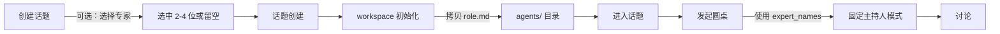
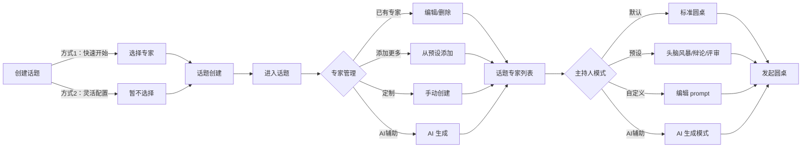

# 增强设计方案：话题级专家管理与可定制主持人模式

**提出时间**：2026-02-17
**设计理念**：基于独立 workspace 的灵活专家与模式管理

---

## 🎯 核心理念

既然每个 topic 都有独立的 `agents/` 目录，我们可以实现更灵活的交互模式：

1. **话题级专家管理**：在话题内动态添加、定制、生成专家
2. **可定制主持人模式**：用户可以自定义或 AI 生成圆桌讨论的主持模式

---

## 📐 设计对比

### 当前设计（P1 + P2 已实现）



**现状**：
- ✅ 创建时可选择专家（expert_names）
- ✅ 每个话题有独立 workspace（agents/ + shared/）
- ✅ agents/ 下每个专家有独立 role.md
- ✅ 圆桌使用 workspace 专家（优先级：workspace role > 全局 skill）
- ⚠️ 创建后无法动态添加/删除专家
- ⚠️ 无法 AI 生成专家
- ⚠️ 主持人模式固定

### 增强设计（渐进式演进）

**核心理念**：保留现有功能，增加灵活性，而非破坏性重构



**优势**：
- ✅ **向后兼容**：现有流程继续工作
- ✅ **渐进增强**：在现有基础上添加功能
- ✅ **双模式创建**：快速（选专家）+ 灵活（后续添加）
- ✅ **动态专家管理**：创建后可添加/删除/编辑
- ✅ **AI 赋能**：AI 生成专家和模式
- ✅ **主持人模式库**：多种预设 + 自定义

---

## 🏗️ 架构设计

### 1. 话题级专家管理（渐进式演进）

#### 数据模型

**保留现有字段，增加元数据管理**：

```python
# Topic 模型（保持向后兼容）
class Topic(BaseModel):
    # ... 其他字段 ...
    expert_names: list[str] = Field(default_factory=list)  # 保留！用于初始专家
    num_rounds: int = 5                                     # 保留！用于默认轮数
    # 实际使用时优先从 workspace/agents/ 动态读取

# 新增：话题专家信息
class TopicExpert(BaseModel):
    name: str                    # physicist | economist_custom
    label: str                   # 物理学研究员 | 经济学家
    description: str             # 专家简介
    source: str                  # "preset" | "custom" | "ai_generated"
    role_file: str               # agents/physicist/role.md
    added_at: str                # 添加时间
    is_from_topic_creation: bool = False  # 是否来自话题创建时的选择
```

**设计说明**：
- `expert_names` 保留但变为"初始专家快速配置"
- 创建话题时选择的专家会标记 `is_from_topic_creation=True`
- 实际圆桌运行时，从 `workspace/agents/` 动态读取（权威来源）
- 这样既保留了快速创建流程，又支持后续动态管理

#### API 设计

```python
# 专家管理 API
GET    /topics/{id}/agents                    # 获取话题的专家列表
POST   /topics/{id}/agents                    # 添加专家（从预设或新建）
PUT    /topics/{id}/agents/{name}             # 更新专家定义
DELETE /topics/{id}/agents/{name}             # 删除专家
POST   /topics/{id}/agents/generate           # AI 生成专家
```

#### API 详细设计

##### POST /topics/{id}/agents - 添加专家

**从预设添加**：
```json
{
  "source": "preset",
  "preset_name": "physicist"
}
```

**新建专家**：
```json
{
  "source": "custom",
  "name": "economist",
  "label": "经济学家",
  "description": "专注于 AI 对经济的影响",
  "role_content": "# 经济学家\n\n你是一位资深经济学家..."
}
```

**AI 生成专家**：
```json
{
  "source": "ai_generated",
  "user_prompt": "我需要一位专注于区块链技术与去中心化治理的专家"
}
```

后端实现：
```python
@router.post("/{topic_id}/agents")
async def add_expert_to_topic(topic_id: str, req: AddExpertRequest):
    if req.source == "preset":
        # 从全局 skills/ 拷贝到 workspace/topics/{id}/agents/{name}/
        copy_preset_expert(topic_id, req.preset_name)
    elif req.source == "custom":
        # 直接创建 agents/{name}/role.md
        create_custom_expert(topic_id, req.name, req.role_content)
    elif req.source == "ai_generated":
        # 调用 Claude SDK 生成 role.md
        role_content = await generate_expert_with_claude(req.user_prompt)
        expert_name = extract_expert_name(role_content)
        create_custom_expert(topic_id, expert_name, role_content)

    return {"message": "Expert added"}
```

##### POST /topics/{id}/agents/generate - AI 生成专家

**请求**：
```json
{
  "prompt": "我需要一位专注于量子计算在生物医药领域应用的跨学科专家，他应该同时具备物理学和生物学背景"
}
```

**后端实现**：
```python
async def generate_expert_with_claude(user_prompt: str) -> str:
    """使用 Claude SDK 生成专家 role.md"""
    system_prompt = """
你是一位专家角色设计助手。根据用户的描述，生成一个圆桌讨论专家的完整角色定义。

输出格式（Markdown）：
# [专家名称]

## 身份
[一句话描述]

## 专长领域
- [领域1]
- [领域2]
- [领域3]

## 思维特点
- [特点1]
- [特点2]
- [特点3]

## 工作区说明
[保持标准格式，复用模板]

## 讨论规则
[保持标准格式，复用模板]
"""

    result = await query(
        prompt=f"用户需求：{user_prompt}\n\n请生成专家角色定义。",
        options=ClaudeAgentOptions(
            system_prompt=system_prompt,
            model="sonnet",
        )
    )

    # 提取生成的 role.md 内容
    return extract_markdown_from_result(result)
```

---

### 2. 可定制主持人模式

#### 数据模型

```python
# 主持人模式
class ModeratorMode(BaseModel):
    id: str                      # "brainstorm" | "debate" | "review"
    name: str                    # "头脑风暴"
    description: str             # "鼓励发散思维，收集创意"
    prompt_template: str         # 主持人 prompt 模板
    num_rounds: int              # 默认轮数
    convergence_strategy: str    # 收敛策略描述

# 话题的主持人模式配置
class TopicModeratorConfig(BaseModel):
    mode_id: str                 # "brainstorm" | "custom"
    custom_prompt: str | None    # 自定义 prompt（如果 mode_id="custom"）
    num_rounds: int              # 轮数
```

#### 预设主持人模式

```python
PRESET_MODERATOR_MODES = {
    "standard": ModeratorMode(
        id="standard",
        name="标准圆桌",
        description="平衡的多轮讨论，逐步收敛",
        prompt_template="""...""",  # 当前的 build_moderator_prompt
        num_rounds=5,
        convergence_strategy="第1轮各抒己见 → 第2轮回应 → 第3轮深化 → 第4轮建议 → 第5轮总结",
    ),
    "brainstorm": ModeratorMode(
        id="brainstorm",
        name="头脑风暴",
        description="鼓励发散思维，收集尽可能多的创意点",
        prompt_template="""
你是头脑风暴的主持人。鼓励专家：
- 大胆提出想法，不要自我限制
- 在他人观点上延展，而非批判
- 关注"如果...会怎样"的可能性
- 每轮尽量提出 2-3 个不同角度的想法

每轮重点：
- 第1-2轮：发散思维，尽可能多的创意
- 第3轮：开始归类整理想法
- 第4轮：选出最有潜力的方向
- 第5轮：为选中方向设计初步路线图
""",
        num_rounds=5,
        convergence_strategy="发散 → 归类 → 筛选 → 路线图",
    ),
    "debate": ModeratorMode(
        id="debate",
        name="辩论赛",
        description="对立观点碰撞，深度论证",
        prompt_template="""
你是辩论赛主持人。将专家分为正方和反方：
- 正方：支持该观点/技术
- 反方：质疑该观点/技术

规则：
- 第1轮：正方陈述立场，反方陈述立场
- 第2-3轮：交叉质询，反驳对方论点
- 第4轮：总结陈词
- 最终：你作为主持人，综合双方观点，给出中立评述
""",
        num_rounds=4,
        convergence_strategy="立场陈述 → 交叉质询 → 总结陈词 → 中立评述",
    ),
    "review": ModeratorMode(
        id="review",
        name="评审会",
        description="严格评审，逐项检查",
        prompt_template="""
你是评审会主持人。要求专家对提案/方案进行全面评审：

评审维度：
1. 技术可行性
2. 创新性
3. 风险与挑战
4. 资源需求
5. 社会影响

每轮聚焦一个维度，要求专家：
- 给出评分（1-10）
- 说明理由
- 提出改进建议
""",
        num_rounds=5,
        convergence_strategy="逐维度评审 → 综合评分 → 改进建议清单",
    ),
}
```

#### API 设计

```python
# 主持人模式 API
GET    /moderator-modes                       # 获取预设模式列表
GET    /topics/{id}/moderator-mode            # 获取话题的主持人模式
PUT    /topics/{id}/moderator-mode            # 设置话题的主持人模式
POST   /topics/{id}/moderator-mode/generate   # AI 生成主持人模式
```

##### PUT /topics/{id}/moderator-mode - 设置模式

**使用预设**：
```json
{
  "mode_id": "brainstorm",
  "num_rounds": 5
}
```

**自定义模式**：
```json
{
  "mode_id": "custom",
  "custom_prompt": "你是一位专注于技术伦理的主持人...",
  "num_rounds": 4
}
```

**AI 生成模式**：
```json
{
  "mode_id": "ai_generated",
  "user_prompt": "我需要一个主持模式，专注于评估 AI 技术在教育领域的应用，要求深入讨论利弊，最后给出可行性建议"
}
```

##### POST /topics/{id}/moderator-mode/generate - AI 生成模式

```python
async def generate_moderator_mode_with_claude(user_prompt: str) -> str:
    """使用 Claude SDK 生成主持人 prompt"""
    system_prompt = """
你是一位主持人 prompt 设计专家。根据用户的需求，生成一个圆桌讨论主持人的完整 prompt。

主持人 prompt 应包含：
1. 主持人角色定位
2. 讨论流程（每轮重点）
3. 收敛策略
4. 对专家的引导要求
5. 最终产出要求

输出格式（纯文本 prompt）：
你是...主持人。话题：「{topic}」

工作目录：...
参与专家：...

请严格按以下流程主持 {num_rounds} 轮讨论：
[详细流程]

收敛策略：
[策略说明]

讨论结束后：
[产出要求]
"""

    result = await query(
        prompt=f"用户需求：{user_prompt}\n\n请生成主持人 prompt。",
        options=ClaudeAgentOptions(
            system_prompt=system_prompt,
            model="sonnet",
        )
    )

    return extract_prompt_from_result(result)
```

---

## 🎨 前端设计

### 1. 创建话题页面调整

**移除专家选择**：
```tsx
// CreateTopic.tsx - 简化版
const [form, setForm] = useState({
  title: '',
  body: '',
  category: '',
  mode: 'roundtable',
  // 移除 expert_names 和 num_rounds（移到话题内配置）
})
```

### 2. 话题详情页 - 新增专家管理区域

```tsx
// TopicDetail.tsx - 新增专家管理面板
<div className="card">
  <h3>专家管理</h3>

  {/* 当前专家列表 */}
  <div className="expert-list">
    {topicExperts.map(expert => (
      <div key={expert.name} className="expert-item">
        <span>{expert.label}</span>
        <span className="expert-source">{expert.source}</span>
        <button onClick={() => editExpert(expert.name)}>编辑</button>
        <button onClick={() => deleteExpert(expert.name)}>删除</button>
      </div>
    ))}
  </div>

  {/* 添加专家 */}
  <div className="add-expert-actions">
    <button onClick={() => showPresetExperts()}>
      📚 从预设添加
    </button>
    <button onClick={() => showCreateExpert()}>
      ✏️ 创建新专家
    </button>
    <button onClick={() => showAIGenerateExpert()}>
      🤖 AI 生成专家
    </button>
  </div>
</div>
```

**AI 生成专家对话框**：
```tsx
<Dialog>
  <h4>AI 生成专家</h4>
  <textarea
    placeholder="描述你需要的专家，例如：我需要一位专注于区块链技术与去中心化治理的专家，他应该..."
    value={aiPrompt}
    onChange={e => setAiPrompt(e.target.value)}
  />
  <button onClick={async () => {
    const result = await expertsApi.generate(topicId, { prompt: aiPrompt })
    // 显示生成的专家，用户可以预览和修改
    setGeneratedExpert(result.data)
  }}>
    生成
  </button>
</Dialog>
```

### 3. 话题详情页 - 新增主持人模式配置

```tsx
<div className="card">
  <h3>主持人模式</h3>

  {/* 当前模式 */}
  <div className="current-mode">
    <strong>{moderatorMode.name}</strong>
    <p>{moderatorMode.description}</p>
  </div>

  {/* 切换模式 */}
  <div className="mode-selector">
    <select onChange={e => setSelectedMode(e.target.value)}>
      <option value="standard">标准圆桌</option>
      <option value="brainstorm">头脑风暴</option>
      <option value="debate">辩论赛</option>
      <option value="review">评审会</option>
      <option value="custom">自定义</option>
    </select>

    <button onClick={() => showAIGenerateMode()}>
      🤖 AI 生成模式
    </button>
  </div>

  {/* 轮数配置 */}
  <div>
    <label>讨论轮数</label>
    <input
      type="number"
      min="1"
      max="10"
      value={numRounds}
      onChange={e => setNumRounds(parseInt(e.target.value))}
    />
  </div>
</div>
```

### 4. 发起圆桌前验证

```tsx
const handleStartRoundtable = async () => {
  // 验证至少有 1 位专家
  if (topicExperts.length === 0) {
    alert('请至少添加 1 位专家后再发起圆桌')
    return
  }

  // 验证已选择主持人模式
  if (!moderatorMode) {
    alert('请配置主持人模式')
    return
  }

  await roundtableApi.start(topicId, {
    moderator_mode_id: moderatorMode.id,
    num_rounds: numRounds,
    max_turns: 60,
    max_budget_usd: 5.0,
  })
}
```

---

## 🔄 工作流程对比

### 当前流程（P1 + P2 已实现）

1. 创建话题 → **可选择专家（physicist, biologist）+ 轮数（5）**
2. 话题创建成功 → workspace 初始化，拷贝 role.md 到 agents/
3. 进入话题详情
4. 发起圆桌 → 使用 topic.expert_names + topic.num_rounds + 固定模式

### 增强流程 A：快速开始模式（兼容现有）

1. 创建话题 → **选择 2-3 位专家 + 轮数**
2. 话题创建成功 → agents/ 自动初始化
3. 进入话题详情 → *（可选）调整专家*
   - 编辑现有专家的 role.md
   - 添加更多专家（预设/手动/AI）
   - 删除不需要的专家
4. *（可选）配置主持人模式*
   - 选择预设模式（头脑风暴/辩论等）
   - 或使用默认标准模式
5. 发起圆桌 → 使用当前 agents/ 目录中的专家 + 配置的模式

### 增强流程 B：灵活配置模式（新增）

1. 创建话题 → **不选专家（或少选）**
2. 话题创建成功 → agents/ 初始化（可能为空或仅有少量专家）
3. 进入话题详情 → **动态组建专家团队**
   - 从预设添加（physicist, biologist, economist）
   - 手动创建特定领域专家
   - AI 生成："我需要一位量子生物学家"
   - 编辑任意专家的 role.md
4. **配置主持人模式**
   - 选择预设模式（头脑风暴、辩论赛、评审会）
   - 自定义主持人 prompt
   - AI 生成模式："专注于评估技术可行性"
5. 发起圆桌 → 使用配置好的专家团队 + 主持人模式

**两种流程的优势**：
- 流程 A：**快速开始**，适合标准讨论，5 分钟发起
- 流程 B：**深度定制**，适合特殊场景，灵活组建团队

---

## 📊 数据存储设计

### 话题级专家存储

```
workspace/topics/{topic_id}/
├── agents/
│   ├── physicist/              # 从预设添加
│   │   └── role.md
│   ├── economist/              # 手动创建
│   │   └── role.md
│   └── quantum_biologist/      # AI 生成
│       └── role.md
├── shared/
└── config/                     # 新增：话题配置目录
    ├── moderator_mode.json     # 主持人模式配置
    └── experts_metadata.json   # 专家元信息（来源、标签等）
```

**experts_metadata.json**：
```json
{
  "experts": [
    {
      "name": "physicist",
      "label": "物理学研究员",
      "source": "preset",
      "added_at": "2026-02-17T12:00:00Z"
    },
    {
      "name": "economist",
      "label": "经济学家",
      "source": "custom",
      "added_at": "2026-02-17T12:05:00Z"
    },
    {
      "name": "quantum_biologist",
      "label": "量子生物学家",
      "source": "ai_generated",
      "generation_prompt": "我需要一位量子生物学家",
      "added_at": "2026-02-17T12:10:00Z"
    }
  ]
}
```

**moderator_mode.json**：
```json
{
  "mode_id": "brainstorm",
  "num_rounds": 5,
  "custom_prompt": null
}
```

或自定义模式：
```json
{
  "mode_id": "custom",
  "num_rounds": 4,
  "custom_prompt": "你是一位专注于技术伦理的主持人..."
}
```

---

## 🚀 渐进式演进策略

### 设计原则

1. **向后兼容**：现有功能继续工作，不破坏已有话题
2. **增量增强**：每个 Phase 都是独立可用的增强，而非依赖链
3. **可选采用**：用户可以选择使用新功能或继续使用旧流程
4. **平滑迁移**：新旧功能可以混用，逐步过渡

### 实现优先级

#### Phase 1A：基础专家管理（核心 - 第一批）

**目标**：在现有基础上增加动态专家管理，不改变创建流程

- [ ] 后端：话题专家查询 API（GET /topics/{id}/agents）
- [ ] 后端：添加专家 API（POST /topics/{id}/agents - 仅支持 preset）
- [ ] 后端：删除专家 API（DELETE /topics/{id}/agents/{name}）
- [ ] 后端：编辑专家 API（PUT /topics/{id}/agents/{name}）
- [ ] 前端：话题详情页专家管理 UI
- [ ] 前端：从预设添加专家对话框
- [ ] 前端：编辑专家对话框
- [ ] 修改：圆桌启动逻辑改为从 workspace/agents/ 读取

**交付成果**：
- ✅ 用户可以在创建话题时选择初始专家（现有功能）
- ✅ 用户可以在话题内动态添加/删除/编辑专家（新功能）
- ✅ 发起圆桌时使用当前 workspace 中的专家（权威来源迁移）

#### Phase 1B：AI 生成专家（增强 - 第二批）

**目标**：增加 AI 辅助生成专家能力

- [ ] 后端：AI 生成专家 API（POST /topics/{id}/agents/generate）
- [ ] 后端：专家生成 prompt 设计与优化
- [ ] 前端：AI 生成专家对话框
- [ ] 前端：生成结果预览与编辑

**交付成果**：
- ✅ 用户可以通过自然语言描述生成专家
- ✅ 支持预览和编辑生成的专家定义

#### Phase 2A：预设主持人模式（增强 - 第三批）

**目标**：提供多种讨论模式选择

- [ ] 后端：预设主持人模式库（4-5 种）
- [ ] 后端：主持人模式 API（GET/PUT）
- [ ] 后端：圆桌执行集成模式配置
- [ ] 前端：模式选择器 UI
- [ ] 前端：模式详情展示

**交付成果**：
- ✅ 用户可以选择预设讨论模式（标准/头脑风暴/辩论/评审）
- ✅ 圆桌讨论按照选定模式执行

#### Phase 2B：自定义与 AI 生成模式（扩展 - 第四批）

**目标**：完全自定义主持人行为

- [ ] 后端：自定义主持人 prompt 支持
- [ ] 后端：AI 生成主持人模式 API
- [ ] 前端：自定义模式编辑器
- [ ] 前端：AI 生成模式对话框

**交付成果**：
- ✅ 用户可以编写自定义主持人 prompt
- ✅ 用户可以通过自然语言生成主持人模式

#### Phase 3：生态与扩展（可选 - 后续）

- [ ] 专家模板库扩展（20+ 预设专家）
- [ ] 模式模板库扩展（10+ 预设模式）
- [ ] 配置导入导出功能
- [ ] 跨话题配置复用
- [ ] 社区模板分享（长期）

---

## 🎯 设计优势

### 1. 灵活性 ✨
- 用户可以在任意时机添加/修改专家
- 不同话题可以有完全不同的专家组合
- 主持人模式可以根据话题特点定制

### 2. AI 赋能 🤖
- AI 生成专家：快速创建特定领域专家
- AI 生成模式：快速适配不同讨论场景
- 降低配置门槛，提升用户体验

### 3. 可扩展性 📈
- 预设模板可以不断增加
- 社区可以分享专家定义和主持人模式
- 支持从其他话题导入配置

### 4. 真正的 Topic Workspace 💪
- 每个话题是完全独立的"讨论空间"
- 专家、模式、讨论历史都属于话题
- 符合"一个话题一个项目"的理念

---

## 🔍 与 P3 的关系

这个增强设计与 P3（单次提问、跟贴追问）是互补的：

| 功能 | 增强设计 | P3 |
|------|---------|-----|
| **专家管理** | 话题级添加/生成专家 | 人 @ 单个专家提问 |
| **交互模式** | 预设/自定义主持人模式 | 跟贴追问（主持人派发专家） |
| **灵活性** | 讨论前配置 | 讨论中动态交互 |

可以**先实现增强设计，再实现 P3**，两者结合会非常强大。

---

## 📝 技术实现要点

### 1. AI 生成专家的 Prompt 设计

```python
EXPERT_GENERATION_SYSTEM_PROMPT = """
你是一位专家角色设计助手。根据用户的描述，生成一个圆桌讨论专家的完整角色定义。

要求：
1. 从用户描述中提取：专业领域、独特视角、思维特点
2. 生成的专家应该与现有专家有明显区别
3. 确保专家定义具体、可执行
4. 保持统一的输出格式

输出格式（严格遵守）：
# [专家名称（英文小写_下划线）]

## 身份
[一句话描述，包含专业领域和独特定位]

## 专长领域
- [具体领域1]
- [具体领域2]
- [具体领域3]

## 思维特点
- [思维方式1]
- [思维方式2]
- [思维方式3]

[后续标准章节自动补充]
"""
```

### 2. AI 生成主持人模式的 Prompt 设计

```python
MODERATOR_MODE_GENERATION_SYSTEM_PROMPT = """
你是一位圆桌讨论主持人 prompt 设计专家。根据用户的需求，生成一个主持人 prompt。

要求：
1. 明确主持人角色定位
2. 设计清晰的讨论流程（每轮重点）
3. 制定收敛策略
4. 提出对专家的引导要求
5. 定义最终产出格式

输出格式（主持人 prompt 全文）：
你是[角色定位]。话题：「{topic}」

工作目录（cwd）：{ws_abs}
...

请严格按以下流程主持 {num_rounds} 轮讨论：
[详细流程，每轮有明确重点]

收敛策略：
[如何从发散到收敛]

讨论结束后：
[产出要求]
"""
```

### 3. 动态读取话题专家

```python
def get_topic_experts(workspace_dir: Path) -> list[str]:
    """从 workspace/topics/{id}/agents/ 读取该话题的专家列表"""
    agents_dir = workspace_dir / "agents"
    if not agents_dir.exists():
        return []

    experts = []
    for expert_dir in agents_dir.iterdir():
        if expert_dir.is_dir() and (expert_dir / "role.md").exists():
            experts.append(expert_dir.name)

    return experts
```

### 4. 动态加载主持人模式

```python
def load_moderator_mode(topic_id: str) -> ModeratorMode:
    """从 workspace/topics/{id}/config/moderator_mode.json 加载模式"""
    config_file = get_workspace_base() / "topics" / topic_id / "config" / "moderator_mode.json"

    if not config_file.exists():
        # 使用默认模式
        return PRESET_MODERATOR_MODES["standard"]

    config = json.loads(config_file.read_text())

    if config["mode_id"] == "custom":
        # 自定义模式
        return ModeratorMode(
            id="custom",
            name="自定义",
            prompt_template=config["custom_prompt"],
            num_rounds=config["num_rounds"],
        )
    else:
        # 预设模式
        return PRESET_MODERATOR_MODES[config["mode_id"]]
```

---

## 🔄 从 P1+P2 到增强设计的平滑过渡

### 当前状态（P1+P2 已实现）

| 组件 | 现状 | 工作方式 |
|------|------|---------|
| Topic 模型 | 有 `expert_names` 字段 | 创建时选择专家 |
| Workspace | `agents/` + `shared/` | 每个专家有独立目录 |
| 专家构建 | `build_experts_from_workspace()` | 优先 workspace role.md |
| 圆桌执行 | 使用 `topic.expert_names` | 从 workspace 读取 role |
| 前端创建 | 专家多选框 | 必选至少 1 位 |

### 过渡策略（保持兼容）

#### 阶段 1：增加元数据层（不改变现有逻辑）

```python
# 新增文件：workspace/topics/{id}/config/experts_metadata.json
{
  "experts": [
    {
      "name": "physicist",
      "label": "物理学研究员",
      "source": "preset",
      "is_from_topic_creation": true,  # 来自创建时选择
      "added_at": "2026-02-17T12:00:00Z"
    }
  ]
}
```

- 创建话题时，根据 `expert_names` 自动生成此文件
- 现有代码无需修改，继续工作
- 为后续动态管理做准备

#### 阶段 2：增加动态管理 API（现有流程不变）

- 新增 API：`GET/POST/PUT/DELETE /topics/{id}/agents`
- 前端新增"专家管理"面板（在话题详情页）
- 用户可以：
  - 查看当前专家（来自 workspace/agents/）
  - 添加更多专家（从预设）
  - 编辑/删除专家
- **现有创建流程继续可用**，新功能是增强

#### 阶段 3：权威来源迁移（逐步）

- 圆桌启动时：
  - ~~从 `topic.expert_names` 读取~~ ❌ 旧方式
  - ✅ 从 `workspace/agents/` 动态读取（新方式）
- `topic.expert_names` 保留但降级为"初始配置参考"
- 实际使用以 workspace 为准

#### 阶段 4：前端流程优化（可选）

- 创建话题页面：
  - 专家选择标记为"可选"
  - 添加说明："可以现在选择，也可以稍后在话题内添加"
  - 允许不选任何专家（创建"空"话题）
- 发起圆桌前：
  - 动态检查 workspace/agents/ 是否有专家
  - 如果没有，引导用户添加

### 迁移影响评估

| 变更 | 影响范围 | 兼容性 | 风险等级 |
|------|---------|--------|---------|
| 增加 config/experts_metadata.json | 无 | 完全兼容 | 🟢 低 |
| 新增专家管理 API | 无 | 完全兼容 | 🟢 低 |
| 圆桌读取来源改为 workspace | 后端逻辑 | 兼容（workspace 内容一致） | 🟡 中 |
| 前端创建流程调整 | 用户体验 | 兼容（可选增强） | 🟢 低 |

**总结**：**零破坏性变更**，所有现有话题和流程继续工作。

## 🎉 总结

这个增强设计将 agent-topic-lab 从"多专家圆桌工具"提升为"灵活的 AI Agent Team 编排平台"：

1. **话题 = 独立的 Agent Team 项目**
2. **用户可以自由组建专家团队**（创建时快速选择 + 后续动态调整）
3. **AI 辅助生成专家和讨论模式**
4. **完全基于 workspace 的隔离设计**
5. **渐进式演进，向后兼容**

这是对现有 P1 + P2 设计的**自然延伸**，充分发挥了 topic workspace 的潜力，同时保持现有功能的稳定性！
