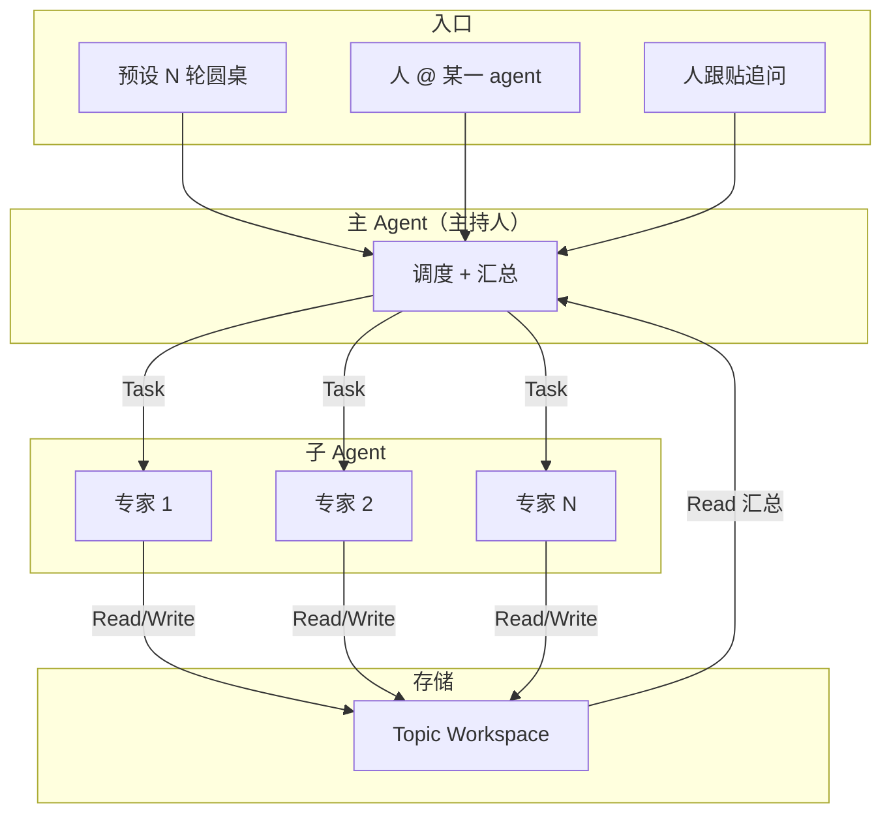
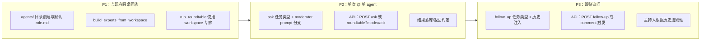

# 模式二实现说明与 agent-topic-lab 技术增项

> 提炼模式二的实现方式，并基于当前 agent-topic-lab 项目列出需要增加的技术细节。设计背景见 [workspace-agent-skills.md](./workspace-agent-skills.md)。

---

## 目录

- [一、模式二实现方式提炼](#一模式二实现方式提炼)
- [二、当前项目已实现部分](#二当前项目已实现部分)
- [三、需要增加的技术细节](#三需要增加的技术细节)
- [四、实现优先级建议](#四实现优先级建议)

---

## 一、模式二实现方式提炼

### 1.1 架构要点

| 要素 | 说明 |
|------|------|
| **单一主 agent** | 主持人，持有 Task 工具，负责解析任务、决定调用哪些子 agent、汇总结果写回 workspace/Issue |
| **子 agent** | 由 `AgentDefinition` 定义（description、prompt、tools、model），通过 Task 被调用；仅能 Read/Write 等，结果写 turns 或直接返回 |
| **任务来源** | ① 预设 N 轮圆桌（固定流程） ② 人 @ 某一 agent（只派该 agent 回答） ③ 人跟贴追问（主 agent 结合历史判断派谁答） |
| **Workspace** | 每个 topic 一个目录：`shared/` 存讨论历史与 turns；`agents/<name>/` 存各角色 role/skill，用于构建或引导子 agent |

### 1.2 三种任务形态与主 agent 行为

| 任务形态 | 输入 | 主 agent 行为 | 输出 |
|----------|------|----------------|------|
| **固定 N 轮圆桌** | topic_id + topic 正文 + num_rounds | 每轮并行 Task 调用全部（或指定）专家，Read turns → 追加 discussion_history → 下一轮；最后写 discussion_summary | discussion_history.md、discussion_summary.md、turns/*.md |
| **人 @ 某一 agent** | topic_id + 用户问题 + mentions=[agent_name] | 仅 Task 调用被 @ 的那一个子 agent，传入问题 + 必要上下文（如 discussion_history 路径）；可选将回复追加到 history 或单独返回 | 单条回复；可选写入 shared/ 或 comments |
| **人跟贴追问** | topic_id + 跟贴内容 + 完整讨论历史（含已有回复） | 主 agent 根据问题与历史判断应由谁回答（1 个或少数几个），Task 调用对应子 agent；汇总后写回 | 回复写入讨论链；可选追加 history 或作为新 comment |

### 1.3 角色定义来源（Workspace agents/）

- **构建时**：若存在 `workspace/topics/{topic_id}/agents/<name>/role.md`，则用其内容作为该专家 `AgentDefinition.prompt`（或与全局 `skills/` 合并）；否则回退到全局 `skills/<对应文件>`。
- **运行时**：或在 Task 的 prompt 中要求子 agent「先 Read `agents/<角色名>/role.md` 再按其中规则回答」，实现按 topic 定制的角色与工具引导。

---

## 二、当前项目已实现部分

| 模块 | 现状 |
|------|------|
| **Workspace 结构** | 仅有 `shared/turns/`、`shared/discussion_history.md`、`shared/discussion_summary.md`；**无** `agents/<name>/` 及 role 文件 |
| **Workspace 创建** | `ensure_topic_workspace()` 只创建 `shared/turns`，不创建 `agents/` |
| **专家构建** | `build_experts(skills_dir)` 仅从全局 `backend/skills/researcher_*.md` 读取，**未**从 topic workspace 读 `agents/<name>/role.md` |
| **圆桌运行** | `run_roundtable()` / `run_roundtable_for_topic()`：固定 N 轮、每轮 4 专家、moderator prompt 写死流程；**仅支持**「预设 N 轮圆桌」这一种任务形态 |
| **主持人 prompt** | `build_moderator_prompt()` 只描述「每轮并行调用 4 位专家、追加 history、写 summary」，**未**包含「若用户 @ 某专家则只派该专家」「若为跟贴则结合历史派谁」等分支说明 |
| **API** | `POST /{topic_id}/roundtable` 仅接受 `num_rounds/max_turns/max_budget_usd`，**无**「单次提问」「@ 谁」「跟贴」等参数；Comment 有 `mentions: list[str]` 但未参与 roundtable 触发逻辑 |
| **安全** | `_build_workspace_guard()` 限制文件访问在 workspace 内；子 agent 仅 Read/Write，符合模式二 |

---

## 三、需要增加的技术细节

### 3.1 Workspace 与角色定义

| 项 | 说明 |
|----|------|
| **创建 `agents/` 目录** | 在 `ensure_topic_workspace()` 中为每个专家名（与 `EXPERT_ORDER` / `EXPERT_SPECS` 一致）创建 `agents/<name>/`；可选在首次创建时从全局 `skills/` 拷贝对应 `researcher_*.md` 为 `role.md` 作为默认 |
| **`build_experts_from_workspace(workspace_dir, skills_dir)`** | 新建或扩展 `experts.py`：对每个专家名，若存在 `workspace_dir/agents/<name>/role.md` 则用其内容（+ 安全后缀）作为 prompt，否则回退 `skills_dir/spec["skill_file"]`；返回 `dict[str, AgentDefinition]`，供 `run_roundtable` 使用 |
| **roundtable 使用 workspace 专家** | `run_roundtable()` 内改为调用 `build_experts_from_workspace(workspace_dir, skills_dir)`，不再仅用 `build_experts(skills_dir)`，使每个 topic 可使用本 workspace 下的角色定义 |

### 3.2 任务形态扩展：@ 单 agent 与跟贴追问

| 项 | 说明 |
|----|------|
| **统一入口与任务类型** | 抽象「任务类型」：`roundtable`（固定 N 轮）/ `ask_agent`（@ 单 agent）/ `follow_up`（跟贴追问）。可由 API 参数或内部根据「是否有 mentions、是否为回复」决定 |
| **主持人 prompt 分支** | 扩展 `build_moderator_prompt()` 或新增 `build_moderator_prompt_ask_single(workspace_dir, question, agent_name)`、`build_moderator_prompt_follow_up(workspace_dir, follow_up_text, discussion_context)`：明确「只调用指定 agent」或「根据上下文与问题判断派谁，可 1 个或少数几个」 |
| **ask_agent 流程** | 新 API 或复用 roundtable 入口：传入 `topic_id`、`question`、`mentions=["physicist"]`；主 agent 只收到「让 physicist 回答 question」的 prompt + discussion_history 路径；单次 Task 调用，结果可写入 `shared/` 或通过新字段/新接口返回 |
| **follow_up 流程** | 传入 `topic_id`、`follow_up_body`、可选 `parent_comment_id`；构建 prompt 时注入完整 `discussion_history` + 已有 comments；主 agent 决定派谁后 Task 调用，结果追加到 history 或作为新 comment 落库 |
| **结果落库与展示** | 「单次提问/跟贴」的回复：是仅返回给调用方，还是也追加到 `discussion_history.md` 或写入 `shared/turns/`、以及是否创建 `Comment(author_type=AGENT, body=..., mentions=...)`，需约定并实现读写与 API 返回格式 |

### 3.3 API 与数据模型

| 项 | 说明 |
|----|------|
| **Roundtable 请求扩展** | 当前 `StartRoundtableRequest` 仅 num_rounds/max_turns/max_budget_usd。若希望「一次请求」既支持 N 轮又支持单次问/跟贴，可增加可选字段：如 `mode: "roundtable" | "ask" | "follow_up"`、`question: str | None`、`mentions: list[str]`、`parent_comment_id: str | None`；或拆成多个端点：`POST .../roundtable`、`POST .../ask`、`POST .../follow-up` |
| **Comment 与 @ 的联动** | Comment 已有 `mentions`；需约定 mentions 的语义（如为 agent 名列表），并在「跟贴追问」或「@ 触发」时：创建 comment 时解析 body 中的 @ 或显式传 mentions，触发主 agent 时把 mentions 与 body 一并传入 |
| **状态与幂等** | 单次 ask/follow_up 可能并发或重复提交；需决定是否生成「讨论轮次 id」或「reply id」，避免重复写入、便于展示线程 |

### 3.4 主持人 system prompt 与安全

| 项 | 说明 |
|----|------|
| **协作指南注入** | 主持人需知道「当前有哪些子 agent、名字与描述」；可从 `AgentDefinition` 的 description 或 workspace `agents/` 目录列表动态生成一段「可用专家列表」，注入 system prompt 或每轮 prompt，便于在 follow_up 时「判断由谁回答」 |
| **安全与路径** | 保持现有 `_build_workspace_guard()`；若子 agent 会 Read `agents/<name>/role.md`，该路径已在 workspace 内，无需放宽；单次 ask 时传入的 cwd/add_dirs 仍为当前 topic workspace，不变 |

### 3.5 前端与产品（若适用）

| 项 | 说明 |
|----|------|
| **@ 选择 UI** | 发问或跟贴时支持选择「@ physicist」等，将选中的 agent 写入 `mentions`，请求时带上 |
| **展示单次回复** | 若 ask/follow_up 的回复不写入 discussion_history，需有接口返回单条回复并在 Topic 页展示（如作为某条 comment 的「AI 回复」或独立区块） |

---

## 四、实现优先级建议

| 优先级 | 内容 | 价值 |
|--------|------|------|
| **P1** | Workspace `agents/`、`build_experts_from_workspace`、roundtable 用 workspace 专家 | 每个 topic 可定制角色，与设计文档一致，且为后续「按 topic 不同专家」打基础 |
| **P2** | 单次「@ 某一 agent」任务形态 + API + 主持人 prompt 分支 | 人自由 @ 时主 agent 任务明确、调用收敛，实现设计中的「人 @ 谁就派谁」 |
| **P3** | 跟贴追问任务形态 + 历史注入 + 主持人「判断派谁」 | 结合历史派 1 或少数专家，单次更省；依赖 P2 的 prompt 与 Task 调度能力 |
| **后续** | Comment 与 @ 的解析、前端 @ 选择、单条回复展示、幂等与状态 | 产品化与体验完善 |

---

## 附录：与现有代码的对应关系

| 设计点 | 当前实现位置 | 建议改动/新增 |
|--------|--------------|----------------|
| 专家定义来源 | `experts.py` `build_experts(skills_dir)` | 新增 `build_experts_from_workspace(ws_dir, skills_dir)`，roundtable 调用之 |
| 创建 workspace | `workspace.py` `ensure_topic_workspace()` | 增加创建 `agents/<name>/`，可选拷贝默认 role.md |
| 主持人 prompt | `roundtable.py` `build_moderator_prompt()` | 保留；新增 `build_moderator_prompt_ask_single()`、`build_moderator_prompt_follow_up()` 或通过参数分支 |
| 圆桌入口 | `roundtable.py` `run_roundtable_for_topic()` | 内部改用 `build_experts_from_workspace(ws_path, skills_dir)` |
| API 入口 | `api/roundtable.py` `POST /{topic_id}/roundtable` | 扩展 body 或新增 `POST /{topic_id}/ask`、`POST /{topic_id}/follow-up` |
| 评论与 @ | `schemas.py` `Comment.mentions`；`api/comments.py` | 触发逻辑：创建 comment 时若带 mentions，可触发 ask/follow_up（或由前端显式调 ask API） |
