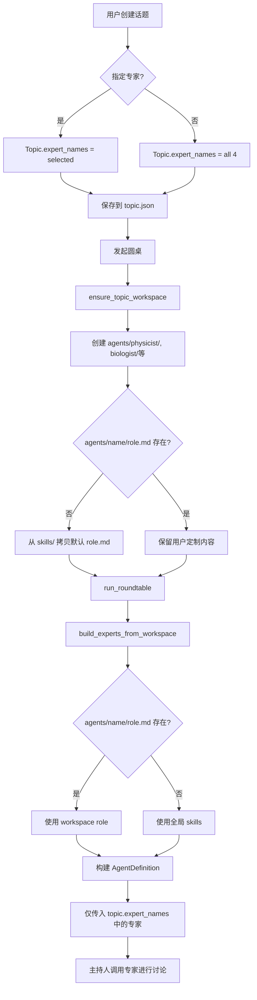

# P2 实现方案：Workspace 角色与专家定制

## 目标

让每个 topic 可以拥有自己的专家角色定义，而不是全局共享。用户可以为特定话题定制专家的系统提示（role），从而让专家在不同话题下具有不同的专业领域侧重或行为特征。

---

## 核心设计理念

### 当前架构（全局专家）
```
backend/skills/
├── researcher_physicist.md      # 全局物理学家定义
├── researcher_biologist.md      # 全局生物学家定义
├── researcher_computer_scientist.md
└── researcher_ethicist.md

所有 topic 共享这 4 个专家定义
```

### 目标架构（Workspace 专家）
```
workspace/topics/{topic_id}/
├── topic.json                   # 话题元数据
├── shared/
│   ├── discussion_history.md
│   └── turns/
└── agents/                      # 👈 新增：本话题的专家定义
    ├── physicist/
    │   └── role.md             # 本话题定制的物理学家角色
    ├── biologist/
    │   └── role.md
    ├── computer_scientist/
    │   └── role.md
    └── ethicist/
        └── role.md

每个 topic 可以有自己的专家定义
```

**回退机制**：如果 `agents/<name>/role.md` 不存在，则使用全局 `skills/researcher_<name>.md`

---

## Task 6: 创建 agents/ 目录结构

### 实现位置
`backend/app/agent/workspace.py` 的 `ensure_topic_workspace()` 函数

### 当前代码
```python
def ensure_topic_workspace(base: Path, topic_id: str) -> Path:
    validate_topic_id(topic_id)
    ws_path = base / "topics" / topic_id
    ws_path.mkdir(parents=True, exist_ok=True)

    # 创建 shared 目录
    shared = ws_path / "shared"
    shared.mkdir(exist_ok=True)
    (shared / "turns").mkdir(exist_ok=True)

    return ws_path
```

### 修改方案
```python
def ensure_topic_workspace(base: Path, topic_id: str) -> Path:
    validate_topic_id(topic_id)
    ws_path = base / "topics" / topic_id
    ws_path.mkdir(parents=True, exist_ok=True)

    # 创建 shared 目录
    shared = ws_path / "shared"
    shared.mkdir(exist_ok=True)
    (shared / "turns").mkdir(exist_ok=True)

    # 👇 新增：创建 agents 目录结构
    _ensure_agents_structure(ws_path)

    return ws_path


def _ensure_agents_structure(ws_path: Path):
    """为每个系统支持的专家创建 agents/<name>/ 目录，并可选拷贝默认 role.md"""
    from .experts import EXPERT_SPECS

    agents_dir = ws_path / "agents"
    agents_dir.mkdir(exist_ok=True)

    skills_dir = Path(__file__).resolve().parent.parent.parent / "skills"

    for expert_name in EXPERT_SPECS.keys():
        expert_dir = agents_dir / expert_name
        expert_dir.mkdir(exist_ok=True)

        # 如果 role.md 不存在，从全局 skills 拷贝默认内容
        role_file = expert_dir / "role.md"
        if not role_file.exists():
            global_skill_file = skills_dir / f"researcher_{expert_name}.md"
            if global_skill_file.exists():
                role_file.write_text(
                    global_skill_file.read_text(encoding="utf-8"),
                    encoding="utf-8"
                )
```

### 行为说明
1. **创建时机**：每次调用 `ensure_topic_workspace` 时（创建话题或发起圆桌前）
2. **目录结构**：为每个专家（physicist, biologist, computer_scientist, ethicist）创建子目录
3. **默认内容**：如果 `role.md` 不存在，从全局 `skills/researcher_*.md` 拷贝
4. **幂等性**：多次调用不会覆盖已存在的 `role.md`（用户可能已定制）

---

## Task 7: build_experts_from_workspace

### 实现位置
`backend/app/agent/experts.py` 新增函数

### 设计思路

**现有函数** `build_experts(skills_dir)` 从全局 skills 目录构建所有专家：
```python
def build_experts(skills_dir: Path) -> dict[str, AgentDefinition]:
    """从全局 skills 目录构建所有专家"""
    experts = {}
    for name, spec in EXPERT_SPECS.items():
        skill_file = skills_dir / spec["file"]
        if skill_file.exists():
            prompt = skill_file.read_text(encoding="utf-8")
            experts[name] = AgentDefinition(
                name=name,
                prompt=prompt + SECURITY_SUFFIX,
            )
    return experts
```

**新增函数** `build_experts_from_workspace(workspace_dir, skills_dir, expert_names)`:
```python
def build_experts_from_workspace(
    workspace_dir: Path,
    skills_dir: Path,
    expert_names: list[str]
) -> dict[str, AgentDefinition]:
    """从 workspace 构建指定专家，回退到全局 skills

    Args:
        workspace_dir: Topic workspace 目录 (workspace/topics/{topic_id})
        skills_dir: 全局 skills 目录 (backend/skills/)
        expert_names: 要构建的专家名称列表（来自 topic.expert_names）

    Returns:
        仅包含 expert_names 中专家的字典
    """
    experts = {}

    for name in expert_names:
        if name not in EXPERT_SPECS:
            logger.warning(f"Unknown expert name: {name}, skipping")
            continue

        spec = EXPERT_SPECS[name]

        # 优先从 workspace 读取
        workspace_role = workspace_dir / "agents" / name / "role.md"
        if workspace_role.exists():
            logger.info(f"Using workspace role for {name}: {workspace_role}")
            prompt = workspace_role.read_text(encoding="utf-8")
        else:
            # 回退到全局 skills
            global_skill = skills_dir / spec["file"]
            if global_skill.exists():
                logger.info(f"Fallback to global skill for {name}: {global_skill}")
                prompt = global_skill.read_text(encoding="utf-8")
            else:
                logger.error(f"No role found for {name}, skipping")
                continue

        experts[name] = AgentDefinition(
            name=name,
            prompt=prompt + SECURITY_SUFFIX,
        )

    return experts
```

### 关键特性
1. **仅构建所选专家**：只为 `expert_names` 中的专家构建 AgentDefinition
2. **优先级**：workspace role.md > 全局 skills/*.md
3. **安全后缀**：两种来源都会添加 SECURITY_SUFFIX
4. **日志记录**：记录使用了哪个来源（便于调试）

---

## Task 8: 圆桌使用 workspace 专家

### 实现位置
`backend/app/agent/roundtable.py` 的 `run_roundtable()` 函数

### 当前代码
```python
async def run_roundtable(
    workspace_dir: Path,
    config: dict[str, str],
    topic: str,
    num_rounds: int = 5,
    expert_names: list[str] = None,
    max_turns: int = 60,
    max_budget_usd: float = 5.0,
) -> dict[str, Any]:
    skills_dir = Path(__file__).resolve().parent.parent.parent / "skills"
    experts = build_experts(skills_dir)  # 👈 构建全局专家
    # ...
```

### 修改方案
```python
async def run_roundtable(
    workspace_dir: Path,
    config: dict[str, str],
    topic: str,
    num_rounds: int = 5,
    expert_names: list[str] = None,
    max_turns: int = 60,
    max_budget_usd: float = 5.0,
) -> dict[str, Any]:
    logger.info(f"Starting run_roundtable with workspace_dir={workspace_dir}")
    logger.info(f"Selected experts: {expert_names}")

    skills_dir = Path(__file__).resolve().parent.parent.parent / "skills"

    # 👇 使用 workspace 专家构建函数
    if expert_names:
        experts = build_experts_from_workspace(workspace_dir, skills_dir, expert_names)
    else:
        # 兼容：未指定专家则使用全局默认
        logger.warning("No expert_names specified, using all global experts")
        experts = build_experts(skills_dir)

    logger.info(f"Built {len(experts)} experts: {list(experts.keys())}")

    # ... 其余代码保持不变
```

### 变更说明
1. **条件使用**：如果有 `expert_names` 则用 workspace 构建，否则回退全局
2. **向后兼容**：旧话题（无 expert_names）仍可正常运行
3. **日志增强**：记录使用了哪些专家

---

## 数据流图



---

## 实现顺序与依赖

### 推荐顺序
```
Task 6 (agents/ 目录)
   ↓
Task 7 (构建函数) ← 可并行
   ↓
Task 8 (集成到圆桌)
```

### 测试策略
1. **Task 6 测试**：创建话题后检查 `workspace/topics/{id}/agents/` 目录是否生成，role.md 是否拷贝
2. **Task 7 测试**：
   - 修改某个 workspace role.md → 验证使用 workspace 版本
   - 删除某个 role.md → 验证回退到全局 skills
   - 指定 expert_names=["physicist", "biologist"] → 验证仅构建这两个
3. **Task 8 测试**：
   - 发起圆桌，检查日志中使用的专家来源
   - 验证讨论历史中只有所选专家的发言

---

## 潜在问题与解决

### Q1: 用户如何编辑 workspace role.md？
**方案**：
- 短期：用户手动编辑 `workspace/topics/{id}/agents/{name}/role.md` 文件
- 长期：可在前端添加"话题专家定制"页面，类似现有的全局专家编辑

### Q2: 旧话题没有 expert_names 怎么办？
**方案**：
- `run_roundtable()` 中判断：`if not expert_names: expert_names = EXPERT_ORDER`
- 确保向后兼容

### Q3: 多次调用 ensure_topic_workspace 会覆盖用户定制吗？
**方案**：
- 使用 `if not role_file.exists()` 条件拷贝
- 已存在的文件不会被覆盖

### Q4: 安全性？workspace role 可以被话题内容注入吗？
**方案**：
- workspace role.md 由文件系统控制，话题内容无法直接修改
- 但要注意前端编辑功能（若实现）的权限校验

---

## 验收标准总结

### Task 6 验收
- [ ] 创建新话题后，`workspace/topics/{id}/agents/` 目录存在
- [ ] 每个系统专家都有对应子目录（physicist, biologist, computer_scientist, ethicist）
- [ ] 每个子目录下有 `role.md` 文件
- [ ] `role.md` 内容与全局 `skills/researcher_*.md` 一致（首次创建）
- [ ] 再次调用不会覆盖已存在的 `role.md`

### Task 7 验收
- [ ] `build_experts_from_workspace()` 函数存在且签名正确
- [ ] 传入 expert_names=["physicist"] 仅返回 physicist
- [ ] workspace role 存在时优先使用
- [ ] workspace role 不存在时回退到全局 skills
- [ ] 返回的 AgentDefinition 包含 SECURITY_SUFFIX

### Task 8 验收
- [ ] `run_roundtable()` 调用 `build_experts_from_workspace()`
- [ ] 日志显示使用了 workspace experts
- [ ] 仅对 topic.expert_names 中的专家进行 Task 调用
- [ ] 旧话题（无 expert_names）仍可正常运行

---

## 时间估算

| Task | 预计工作量 | 主要风险 |
|------|-----------|---------|
| Task 6 | 30-45分钟 | 文件路径处理、幂等性保证 |
| Task 7 | 45-60分钟 | 回退逻辑、日志记录 |
| Task 8 | 15-30分钟 | 集成测试、向后兼容 |
| **总计** | **1.5-2.5小时** | 跨模块集成测试 |

---

## 后续扩展可能性

1. **前端编辑界面**：话题详情页增加"定制专家"按钮，直接编辑 workspace role.md
2. **模板库**：提供多套预设专家模板（如"学术严谨型"、"科普友好型"）
3. **版本控制**：记录 role.md 的修改历史
4. **专家能力扩展**：除了 role.md，还可添加 tools.json 定义该专家可用的工具
