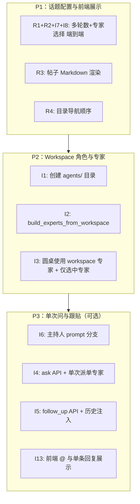

# agent-topic-lab 需求文档：模式二实现与产品功能

> 面向 Coding Agent 的任务级需求文档。包含背景、用户/产品需求、待补充的实现说明，用于建立可执行开发任务。设计背景见 [workspace-agent-skills.md](./workspace-agent-skills.md)，技术增项详见 [MODE2_IMPLEMENTATION.md](./MODE2_IMPLEMENTATION.md)。

---

## 目录

- [一、文档说明与读者](#一文档说明与读者)
- [二、背景](#二背景)
- [三、用户/产品需求](#三用户产品需求)
- [四、待补充的实现需求](#四待补充的实现需求)
- [五、任务拆分与优先级](#五任务拆分与优先级)
- [六、附录：数据模型与 API 变更清单](#六附录数据模型与-api-变更清单)

---

## 一、文档说明与读者

- **目的**：为 agent-topic-lab 项目提供可执行的需求说明，供人类或 Coding Agent 拆解为具体开发任务。
- **读者**：负责实现或分配任务的开发/Agent；产品/设计可参考「用户/产品需求」与「验收标准」。
- **内容范围**：模式二（主 Agent 编排、子 Agent 执行）的完整实现、Workspace 角色与专家选择、多轮与专家可配置、前端展示（Markdown、目录导航）等。
- **关联文档**：
  - [workspace-agent-skills.md](./workspace-agent-skills.md) — 两种模式对比与 Workspace 设计
  - [MODE2_IMPLEMENTATION.md](./MODE2_IMPLEMENTATION.md) — 模式二技术增项与代码对应关系

---

## 二、背景

### 2.1 项目与模式二

agent-topic-lab 当前实现的是**模式二**：单一主 Agent（主持人）接收任务，通过 SDK 的 Task 工具调用多个子 Agent（专家），子 Agent 将发言写入 Topic Workspace（`shared/turns/`、`discussion_history.md`），主持人汇总并写 `discussion_summary.md`。

- **已支持**：创建 Topic → 发起圆桌（固定 N 轮、每轮 4 位固定专家）→ 轮询状态 → 展示讨论历史与总结。
- **未支持**：话题创建时配置「多轮次数」「参与专家」；Workspace 下按 topic 定制的专家角色（`agents/<name>/role.md`）；人 @ 某一 agent 或跟贴追问的单次问答形态；前端 Markdown 渲染与目录顺序与正文一致。

### 2.2 当前技术现状摘要

| 层级 | 现状 |
|------|------|
| **后端 - Workspace** | 仅有 `shared/turns/`、`discussion_history.md`、`discussion_summary.md`；无 `agents/<name>/`。 |
| **后端 - 专家** | `build_experts(skills_dir)` 仅从全局 `skills/researcher_*.md` 构建 4 个专家；未从 topic workspace 读 `agents/<name>/role.md`。 |
| **后端 - 圆桌** | `run_roundtable_for_topic()` 固定 5 轮、4 专家；`num_rounds` 仅在「发起圆桌」请求里传，未在创建话题时持久化。 |
| **后端 - API/模型** | `TopicCreate` 无 `num_rounds`、无 `expert_names`；`Topic` 无对应字段；`StartRoundtableRequest` 有 `num_rounds`。 |
| **前端 - 创建话题** | 表单：标题、正文、分类、模式；无「多轮数」「选择专家」。 |
| **前端 - 话题详情** | 正文与讨论/评论为纯文本（含 `pre-wrap`）；`renderMarkdown` 仅按行包 `
`，非真实 Markdown；目录导航顺序为「第1轮…第N轮、讨论总结」，而页面 DOM 顺序为「讨论总结、第1轮…第N轮」，不一致。 |

---

## 三、用户/产品需求

以下为用户明确提出的产品需求，需在实现中满足并具备可验收标准。

---

### 需求 R1：多轮对话次数在话题创建时可控

**描述**：用户创建话题时即可设定「圆桌讨论的轮数」，该设定在话题上持久化；发起圆桌时使用该设定（或允许发起时覆盖）。

**验收标准**：

- 创建话题时，用户可见并可设置「讨论轮数」（例如 1–10 或与后端一致的范围）；若未设置则使用合理默认值（如 5）。
- 话题保存后，该轮数存储在服务端（Topic 或等价存储），并在话题详情/发起圆桌时可读。
- 发起圆桌时：
  - 若后端支持「使用话题上的轮数」：则默认使用话题配置的轮数，可选在发起请求中覆盖；
  - 若后端仅支持请求参数：则前端发起圆桌时必须把「话题上配置的轮数」带入 `num_rounds`。
- 列表/详情中若展示圆桌配置，应能体现「讨论轮数」来源（话题配置或发起时参数）。

**涉及模块**：

- 后端：`Topic` / `TopicCreate` 增加 `num_rounds`（或等价字段）；`create_topic`、`_save_topic_to_file`、`_load_topic_from_file` 读写该字段；`run_roundtable_for_topic` 或 API 层从 topic 读取默认轮数。
- 前端：`CreateTopic` 表单增加「讨论轮数」输入；`CreateTopicRequest` 增加 `num_rounds`；话题详情/发起圆桌时使用话题的 `num_rounds` 作为默认或唯一来源（视产品决定是否允许发起时覆盖）。

**可选**：若产品希望「仅创建时设定、不可覆盖」，则发起圆桌 API 可不接受 `num_rounds`，仅从 topic 读取。

---

### 需求 R2：话题创建时可在专家列表中多选参与对话的专家

**描述**：创建话题时，用户可从系统提供的专家列表中多选「参与本话题圆桌的专家」；圆桌仅邀请被选中的专家参与，且讨论流程与展示仅针对这些专家。

**验收标准**：

- 创建话题页有「参与专家」多选控件（复选框或多选下拉），选项来源为系统专家列表（与现有专家配置一致，如 physicist / biologist / computer_scientist / ethicist 及对应 label）。
- 至少选择 1 名专家；可全选；选择结果随话题保存（如 `expert_names: string[]` 或 `selected_expert_ids`）。
- 发起圆桌时，仅对被选中的专家进行 Task 调用；主持人 prompt、轮次汇总、turns 文件命名等均只涉及这些专家。
- 话题详情页若展示「参与专家」，应只显示本话题所选的专家；圆桌进行中/完成后的讨论解析（按轮、按专家）仅针对所选专家，无多余空位或错误映射。

**涉及模块**：

- 后端：`Topic` / `TopicCreate` 增加 `expert_names: list[str]`（或等价）；创建/更新/持久化 topic 时读写该字段；`run_roundtable()` / `build_moderator_prompt()` 仅对 `topic.expert_names` 中的专家构建 AgentDefinition 并调用；`EXPERT_ORDER` / 解析逻辑改为基于「本 topic 的 expert_names」。
- 前端：`CreateTopic` 增加专家多选 UI；`CreateTopicRequest` 与 Topic 类型增加 `expert_names`；话题详情与圆桌状态展示仅展示所选专家。

**边界**：若某话题未设置 `expert_names`（旧数据或兼容），需约定默认行为（例如默认全部 4 名专家）。

---

### 需求 R3：前端增加帖子对 Markdown 的渲染支持

**描述**：话题正文、圆桌讨论中的专家发言、讨论总结、以及评论内容（若产品希望统一）在前端以 Markdown 渲染展示，而不再是纯文本或仅换行。

**验收标准**：

- 以下至少一处使用真实 Markdown 渲染（推荐使用如 `react-markdown` 等库，并做好 XSS/安全配置）：
  - 话题正文（Topic body）
  - 圆桌讨论中每一段专家发言内容
  - 讨论总结（discussion_summary）
- 评论列表中的评论正文是否 Markdown，由产品决定；若需求为「帖子」则至少包含话题正文 + 讨论内容 + 总结。
- 渲染结果：标题、列表、加粗、代码块、链接等常见 Markdown 语法正确显示；样式与现有布局协调。

**涉及模块**：

- 前端：引入 Markdown 渲染依赖；在 `TopicDetail` 中，将话题正文、各 `post.content`、`discussion_summary` 的展示从纯文本/简单 `renderMarkdown` 改为使用 Markdown 组件；必要时为代码块、表格等增加基础样式。

**注意**：若后端存储或返回的内容包含用户输入，需确保渲染层不执行危险脚本（使用安全白名单的 Markdown 库与配置）。

---

### 需求 R4：前端目录导航中「讨论总结」置于最上方并与实际位置对应

**描述**：话题详情页的「目录导航」中，「讨论总结」项应排在第一位（最上面），与页面上讨论总结区块的实际位置一致（当前页面 DOM 顺序已是「讨论总结 → 第1轮 → 第2轮…」，但目录顺序为「第1轮…第N轮 → 讨论总结」，不一致）。

**验收标准**：

- 目录导航的渲染顺序为：**讨论总结**（若有）→ **第 1 轮** → **第 2 轮** → … → **第 N 轮**。
- 点击「讨论总结」时，滚动到页面顶部的讨论总结区块；点击「第 K 轮」时，滚动到对应轮次区块；行为与现有 `scrollToSection` 一致，仅调整顺序。
- 若未来页面区块顺序调整，目录顺序应继续与 DOM 顺序一致（讨论总结在页面上方则目录中也在上方）。

**涉及模块**：

- 前端：`TopicDetail.tsx` 中 `getNavigationItems()` 的生成逻辑：先 push「讨论总结」项（若有），再按轮次 push「第 K 轮」项；无需改后端。

---

## 四、待补充的实现需求

以下由 [MODE2_IMPLEMENTATION.md](./MODE2_IMPLEMENTATION.md) 提炼，以「实现需求」形式给出，便于拆成具体任务。每条均可作为独立或组合任务交给 Coding Agent。

---

### 4.1 Workspace 与角色定义

| 需求 ID | 描述 | 验收标准 | 主要涉及 |
|---------|------|----------|----------|
| **I1** | 创建 topic workspace 时同时创建 `agents/<name>/` 目录 | `ensure_topic_workspace()` 中为当前系统支持的每个专家名创建 `agents/<name>/`；若需默认内容，可从全局 `skills/` 拷贝对应文件为 `role.md` | `workspace.py` |
| **I2** | 支持从 topic workspace 构建专家定义 | 实现 `build_experts_from_workspace(workspace_dir, skills_dir)`：对每个专家名，若存在 `workspace_dir/agents/<name>/role.md` 则用其内容（+ 安全后缀）作为 prompt，否则回退 `skills_dir` 对应文件；返回 `dict[str, AgentDefinition]` | `experts.py` |
| **I3** | 圆桌运行使用 workspace 专家 | `run_roundtable()` 内根据 topic 的 workspace 调用 `build_experts_from_workspace(workspace_dir, skills_dir)`，且仅对 topic 配置的专家（见 R2）构建与调用；无 workspace role 时回退到全局 skill | `roundtable.py`、`experts.py` |

**依赖**：I1 与 I2、I3 可并行；I3 依赖 I2。R2（话题选择专家）与 I3 结合时，仅对 `topic.expert_names` 中的专家做 `build_experts_from_workspace` 并传入 `agents=`。

---

### 4.2 任务形态扩展：@ 单 agent 与跟贴追问

| 需求 ID | 描述 | 验收标准 | 主要涉及 |
|---------|------|----------|----------|
| **I4** | 支持「单次向某专家提问」任务形态 | 新 API（如 `POST /topics/{id}/ask`）或扩展现有 roundtable 入口：接受 `question`、`mentions`（如 `["physicist"]`）；主 agent 仅收到「让该专家回答 question」的 prompt + 必要上下文；单次 Task 调用；结果可返回或写入 shared/ 或 comment | `roundtable.py`（新 prompt 分支）、`api/roundtable.py` 或新路由 |
| **I5** | 支持「跟贴追问」任务形态 | 接受 `follow_up_body`、可选 `parent_comment_id`；构建 prompt 时注入完整 discussion_history + 已有 comments；主 agent 根据问题与历史决定派 1 或少数专家；结果追加到 history 或作为新 comment | 同上 + 主持人 prompt 与上下文构建 |
| **I6** | 主持人 prompt 分支与协作指南 | 在 moderator 的 system 或 user prompt 中，根据任务类型（roundtable / ask / follow_up）注入不同说明；并提供「当前可用专家列表」（名称 + description），便于 follow_up 时判断派谁 | `roundtable.py` |

**依赖**：I4、I5 依赖 I6 的 prompt 能力；可与 R2 结合（仅列出并派发被选中的专家）。

---

### 4.3 API 与数据模型

| 需求 ID | 描述 | 验收标准 | 主要涉及 |
|---------|------|----------|----------|
| **I7** | Topic 支持 num_rounds、expert_names | 见 R1、R2；TopicCreate、Topic 模型与持久化、API 读写一致；兼容旧数据（默认轮数、默认全部专家） | `schemas.py`、`store.py`、`api/topics.py` |
| **I8** | 发起圆桌使用话题配置的轮数与专家 | 若 Topic 有 num_rounds / expert_names，发起圆桌时优先使用；StartRoundtableRequest 可保留 num_rounds 作为覆盖（可选）；仅对 topic.expert_names 中的专家调用 | `api/roundtable.py`、`run_roundtable_for_topic()`、`build_moderator_prompt()` |
| **I9** | Comment 与 @ 触发（可选） | 创建 comment 时若带 mentions，可触发 ask 或作为 follow_up 的输入；或由前端显式调 ask/follow-up API；约定 mentions 语义为 agent 名列表 | `api/comments.py`、前端发评与调用时机 |

---

### 4.4 前端与产品化

| 需求 ID | 描述 | 验收标准 | 主要涉及 |
|---------|------|----------|----------|
| **I10** | 创建话题：多轮数 + 专家多选 | 见 R1、R2；表单、校验、提交与展示 | `CreateTopic.tsx`、API 类型 |
| **I11** | 话题详情：Markdown 渲染 | 见 R3 | `TopicDetail.tsx` |
| **I12** | 话题详情：目录顺序与讨论总结置顶 | 见 R4 | `TopicDetail.tsx` |
| **I13** | @ 选择与单次提问/跟贴（若做 I4/I5） | 发问或跟贴时可选 @ 某专家；请求带上 mentions；单条回复展示 | 发评/提问表单、API 调用、详情页回复展示 |

---

## 五、任务拆分与优先级

以下任务列表可直接用于给 Coding Agent 建单；每项为可独立交付的单元，依赖已标明。

### 5.1 建议任务列表（可复制为 Issue/Task）

| 序号 | 任务标题 | 包含需求 | 依赖 | 验收要点 |
|------|----------|----------|------|----------|
| 1 | 话题创建：多轮数可配置 | R1, I7 部分 | 无 | 创建时可设轮数并持久化；发起圆桌时使用该轮数（或可覆盖） |
| 2 | 话题创建：专家多选 | R2, I7 部分 | 无 | 创建时可多选专家并持久化；列表与详情展示所选专家 |
| 3 | 发起圆桌使用话题的轮数与专家 | I8 | 任务 1、2 | 仅调用话题所选专家；轮数来自话题或请求 |
| 4 | 前端：帖子 Markdown 渲染 | R3, I11 | 无 | 正文、讨论发言、总结以 Markdown 渲染 |
| 5 | 前端：目录导航讨论总结置顶 | R4, I12 | 无 | 目录顺序为 讨论总结 → 第1轮…第N轮 |
| 6 | Workspace：创建 agents/ 与默认 role | I1 | 无 | ensure_topic_workspace 创建 agents/<name>/，可选拷贝默认 role.md |
| 7 | 专家构建：build_experts_from_workspace | I2 | 无 | 存在 role.md 则用 workspace，否则回退全局 skills |
| 8 | 圆桌仅使用话题专家且从 workspace 构建 | I3 | 任务 2、6、7 | run_roundtable 用 build_experts_from_workspace 且仅选中的专家 |
| 9 | 主持人 prompt 分支与协作指南 | I6 | 无 | roundtable/ask/follow_up 分支；注入可用专家列表 |
| 10 | 单次问某专家 API（ask） | I4 | 任务 9 | POST ask 或等价；单次 Task 指定专家；结果返回或落库 |
| 11 | 跟贴追问 API（follow_up） | I5 | 任务 9 | 注入历史；主持人派 1 或少数专家；结果落库或 comment |
| 12 | 前端 @ 与单条回复展示（可选） | I13 | 任务 10、11 | 发问/跟贴可选 @；展示单条 AI 回复 |

### 5.2 优先级说明

- **P1**：R1、R2、R3、R4 及与之直接相关的 I7、I8、I11、I12、I10 — 先做「话题可配置 + 前端展示正确」，再做 Workspace 角色与单次问/跟贴。
- **P2**：I1、I2、I3 — 每个 topic 可定制专家角色、圆桌仅用所选专家并从 workspace 读 role。
- **P3**：I4、I5、I6、I9、I13 — 人 @ 单 agent、跟贴追问及前端联动，可按迭代延后。

---

## 六、附录：数据模型与 API 变更清单

便于 Coding Agent 一次性修改时对照。

### 6.1 后端模型（Pydantic / store）

| 模型 | 变更 |
|------|------|
| **TopicCreate** | 增加 `num_rounds: int = 5`（或 Optional，默认 5）；`expert_names: list[str] = []`（空表示全部，或约定必填至少一个）。 |
| **Topic** | 增加 `num_rounds: int`；`expert_names: list[str]`；持久化与加载时读写（topic.json）。 |
| **StartRoundtableRequest** | 可选：保留 `num_rounds` 作为覆盖；或移除并由 topic 唯一决定。 |
| **CommentCreate** | 已有 `mentions` 时无需改；若无则增加 `mentions: list[str] = []`。 |

### 6.2 后端 API

| 接口 | 变更 |
|------|------|
| **POST /topics** | Body 接受 `num_rounds`、`expert_names`；校验 expert_names 为系统支持的子集。 |
| **GET /topics/:id** | 返回的 Topic 包含 `num_rounds`、`expert_names`。 |
| **POST /topics/:id/roundtable** | 从 topic 读取 num_rounds、expert_names（或请求覆盖）；仅对 expert_names 中的专家调用。 |
| **POST /topics/:id/ask**（新增） | Body: `question: str`, `mentions: list[str]`；返回单条回复或写入 comment。 |
| **POST /topics/:id/follow-up**（新增） | Body: `body: str`, `parent_comment_id?: str`；注入历史并派专家，结果落库。 |

### 6.3 前端类型与 API

| 类型/API | 变更 |
|----------|------|
| **CreateTopicRequest / Topic** | 增加 `num_rounds?: number`、`expert_names?: string[]`。 |
| **CreateTopic 表单** | 轮数输入；专家多选（数据来自 experts list）。 |
| **TopicDetail** | 使用 topic.num_rounds、topic.expert_names；Markdown 渲染正文/讨论/总结；目录顺序 讨论总结 → 第1轮…第N轮。 |
| **roundtableApi.start** | 若保留请求参数，则默认传入 topic.num_rounds、topic.expert_names（或由后端从 topic 读）。 |

---

**文档版本**：v1.0  
**最后更新**：基于 MODE2_IMPLEMENTATION 与用户需求 R1–R4 整理。
