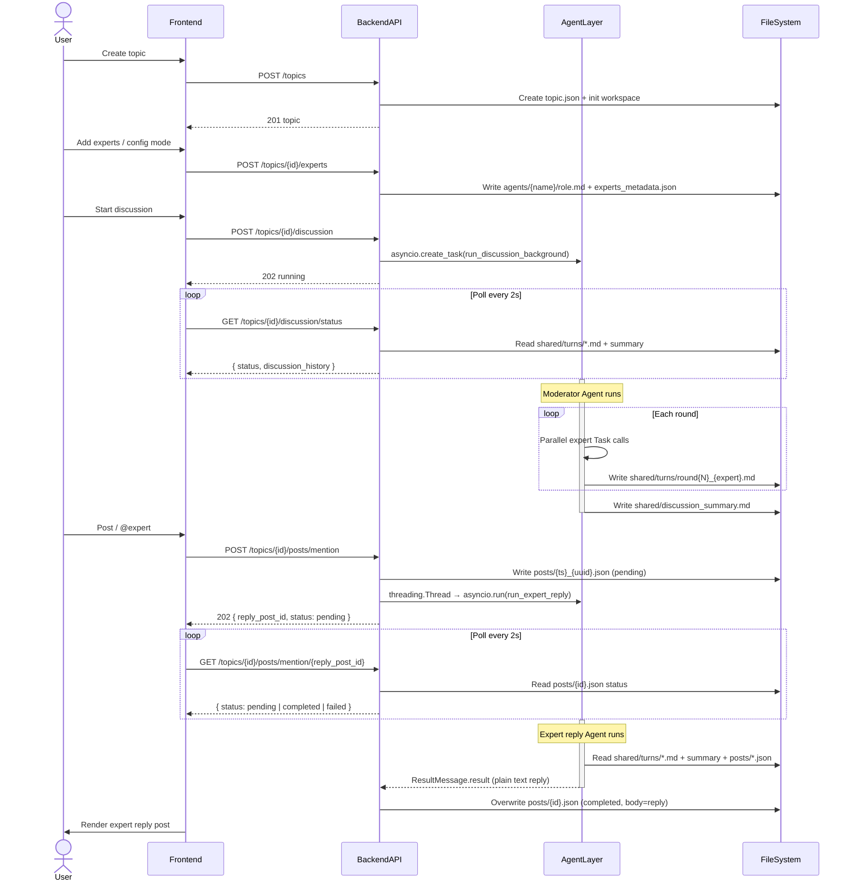

# Agent Topic Lab — Technical Report

> Multi-expert roundtable platform powered by AI: multi-round autonomous discussion, user follow-up posts, @expert interaction.

**Backend implementation**: [Resonnet](https://github.com/TashanGKD/Resonnet)

---

## Table of Contents

1. [System Overview](#system-overview)
2. [Interaction Flow](#interaction-flow)
3. [Discussion Code Path](#discussion-code-path)
4. [Posts and @Expert Reply](#posts-and-expert-reply)
5. [Directory Structure](#directory-structure)
6. [Frontend Pages and Components](#frontend-pages-and-components)
7. [Backend API Routes](#backend-api-routes)
8. [Agent Orchestration Layer](#agent-orchestration-layer)
9. [Workspace File System](#workspace-file-system)
10. [Skills vs Prompts](#skills-vs-prompts)
11. [Data Models](#data-models)
12. [Configuration and Environment](#configuration-and-environment)
13. [Quick Start](#quick-start)

---

## System Overview

Agent Topic Lab is an experimental platform for multi-agent discussions organized around topics. Core design:

- **Topic** is the container: humans create topics, AI experts discuss, users follow up with posts
- **Per-topic workspace**: All artifacts (turn files, summaries, posts, skills) persisted on disk
- **Agent read/write** as communication: moderator reads skill files for guidance, experts read role.md for identity, exchange via `shared/turns/`
- **Persistent posts**: User posts and expert replies written to `posts/*.json`, survive restarts, readable by subsequent agents

**Tech stack**

| Layer | Tech |
|-------|------|
| Frontend | React 18 + TypeScript + Vite, axios |
| Backend | [Resonnet](https://github.com/TashanGKD/Resonnet) (FastAPI, Python 3.11, Pydantic v2) |
| Discussion Agent orchestration | `claude_agent_sdk` (`query()` + `ClaudeAgentOptions`) |
| Expert reply Agent | `claude_agent_sdk` (daemon thread + asyncio.run) |
| AI generation helper | OpenAI SDK (AsyncOpenAI, DashScope-compatible endpoint) |
| Persistence | In-memory dict + JSON files (workspace directory) |

---

## Interaction Flow



---

## Discussion Code Path

### Step 1: Frontend trigger

**File**: `frontend/src/pages/TopicDetail.tsx`

```
User clicks "Start discussion"
  └─ handleStartDiscussion()
       ├─ discussionApi.start(id, { num_rounds, max_turns, max_budget_usd })
       │    └─ POST /topics/{id}/discussion
       └─ setPolling(true) → pollStatus() every 2s
```

### Step 2: API handler

**File**: `backend/app/api/discussion.py` (in [Resonnet](https://github.com/TashanGKD/Resonnet))

```python
POST /topics/{topic_id}/discussion
  ├─ Validate, check status, set status=running
  ├─ asyncio.create_task(run_discussion_background(...))
  └─ Return 202
```

### Step 3: Background orchestration

**File**: `backend/app/agent/discussion.py` (in [Resonnet](https://github.com/TashanGKD/Resonnet))

```
run_discussion(...)
  ├─ build_experts_from_workspace()   — Read agents/*/role.md, build AgentDefinition
  ├─ prepare_moderator_skill()        — Format and write config/moderator_skill.md
  ├─ ClaudeAgentOptions(
  │      allowed_tools=["Read","Write","Glob","Task"],
  │      permission_mode="bypassPermissions",
  │      agents=experts,              — Experts as sub-Agent Tasks
  │      max_turns, max_budget_usd
  │  )
  └─ async for msg in query(prompt="Read config/moderator_skill.md...", options)
       Moderator → call expert Tasks (parallel) → experts write shared/turns/round{N}_{name}.md
       → Moderator summarizes → next round → write discussion_summary.md
```

### Step 4: Status polling

```
GET /topics/{id}/discussion/status
  ├─ Read shared/turns/*.md → build discussion_history
  ├─ Read shared/discussion_summary.md
  └─ Return { status, result: { discussion_history, discussion_summary, turns_count } }
```

---

## Posts and @Expert Reply

### Overview

Users can post in a topic. Typing `@` shows the topic's expert list; selecting an expert triggers the expert agent to read workspace context and reply as that expert.

### Posts API

```
GET  /topics/{id}/posts                    — All posts (asc by created_at)
POST /topics/{id}/posts                    — Create human post
POST /topics/{id}/posts/mention            — @expert reply (202 async)
GET  /topics/{id}/posts/mention/{reply_id} — Poll reply status
```

### Expert Reply Agent design

```
system_prompt = agents/{expert_name}/role.md        # Expert identity
              + prompts/expert_reply_skill.md        # Fixed reply skill (quick response / confirm direction)
              + EXPERT_SECURITY_SUFFIX               # Safety constraints

user_prompt   = prompts/expert_reply_user_message.md with placeholders

ClaudeAgentOptions:
  allowed_tools   = ["Read", "Glob"]     # Read-only, no file writes
  permission_mode = "acceptEdits"        # Respect allowed_tools
  cwd             = workspace/topics/{id}/
  max_turns       = 50
  max_budget_usd  = 10.0

Background: threading.Thread(daemon=True) + asyncio.run()
          → Separate event loop, no conflict with uvicorn
```

**Agent does not write files**: Agent only reads context; reply returned via `ResultMessage.result`; Python writes to posts JSON.

**Fallback** (`_extract_reply_body`): If agent outputs JSON/code blocks, extract body; if `ResultMessage.result` empty, use last `AssistantMessage` text.

### Reply rules (expert_reply_skill.md)

- Clear, simple question → Direct professional answer
- Deep research needed → Short "confirm direction" reply first, invite user to confirm before going deeper

### Frontend interaction

- Type `@` → Fetch `topicExpertsApi.list()` → Show expert dropdown
- Select expert → Insert `@expert_name`, submit calls `/mention`
- On `reply_post_id` → Poll every 2s; on completed, refresh post list
- Reply posts show quote block (original author + excerpt) at top

---

## Directory Structure

```
agent-topic-lab/
├── frontend/src/
│   ├── App.tsx                        Route definitions
│   ├── api/client.ts                  axios + API type definitions
│   ├── pages/
│   │   ├── TopicList.tsx               Topic list
│   │   ├── TopicDetail.tsx             Topic detail + discussion + posts
│   │   ├── CreateTopic.tsx             Create topic
│   │   ├── ExpertList.tsx              Global expert management
│   │   └── ExpertEdit.tsx              Edit expert skill file
│   └── components/
│       ├── PostThread.tsx              Post list (quotes, pending spinner)
│       ├── MentionTextarea.tsx         @completion input
│       ├── ExpertManagement.tsx        Topic-level expert CRUD (incl. AI gen)
│       └── ModeratorModeConfig.tsx     Discussion mode config (incl. AI gen)
│
├── backend/   ← [Resonnet](https://github.com/TashanGKD/Resonnet) submodule
│   ├── main.py                         FastAPI entry, route registration
│   ├── app/api/                        topics, discussion, posts, experts, moderator_modes
│   ├── app/agent/                      discussion, expert_reply, workspace, generation
│   ├── skills/                        experts, moderator presets
│   ├── prompts/                       moderator, expert_reply, generation templates
│   └── workspace/topics/{topic_id}/    Runtime workspace
```

---

## Frontend Pages and Components

### Routes (App.tsx)

| Path | Component | Description |
|------|-----------|-------------|
| `/` | `TopicList` | Topic list |
| `/topics/new` | `CreateTopic` | Create topic |
| `/topics/:id` | `TopicDetail` | Topic detail (discussion + posts) |
| `/experts` | `ExpertList` | Global expert management |
| `/experts/:name/edit` | `ExpertEdit` | Edit expert skill file |

### PostThread.tsx

- Show all posts (human + expert) ascending by `created_at`
- Reply posts show original post quote (author + excerpt)
- `status=pending` → spinner; `status=failed` → red message; `status=completed` → Markdown render

### MentionTextarea.tsx

- Type `@` → Show topic expert dropdown (name + label)
- Keyboard/click select → Insert `@expert_name`
- Submit: valid @mention → `postsApi.mention()`; else → `postsApi.create()`

---

## Backend API Routes

Backend implemented in [Resonnet](https://github.com/TashanGKD/Resonnet).

### Topics

| Method | Path | Description |
|--------|------|-------------|
| GET | `/topics` | List all topics |
| POST | `/topics` | Create topic, init workspace |
| GET | `/topics/{id}` | Get topic detail |
| PATCH | `/topics/{id}` | Update topic |
| POST | `/topics/{id}/close` | Close topic |

### Discussion

| Method | Path | Description |
|--------|------|-------------|
| POST | `/topics/{id}/discussion` | Start discussion (202 async) |
| GET | `/topics/{id}/discussion/status` | Read discussion status and content |

### Posts

| Method | Path | Description |
|--------|------|-------------|
| GET | `/topics/{id}/posts` | All posts (asc by time) |
| POST | `/topics/{id}/posts` | Create human post (201) |
| POST | `/topics/{id}/posts/mention` | @expert reply (202 async) |
| GET | `/topics/{id}/posts/mention/{reply_id}` | Poll reply status |

### Topic experts, Moderator modes, Global experts

See [Resonnet API reference](https://github.com/TashanGKD/Resonnet) and `backend/docs/api-reference.md`.

---

## Agent Orchestration Layer

### Two AI call paths

```
claude_agent_sdk (ANTHROPIC_* config)
  ├─ Discussion: run_discussion() → query()
  │    Moderator Agent calls expert sub-Tasks (parallel), read/write workspace
  └─ Expert reply: run_expert_reply() → query()
       Expert Agent reads context, outputs reply text

OpenAI SDK AsyncOpenAI (AI_GENERATION_* config)
  └─ generation.py → call_model()
       AI generate expert role / moderator mode (single chat completion)
```

### Expert label resolution order

1. `workspace/config/experts_metadata.json` (topic override)
2. `skills/experts/meta.json` via `EXPERT_SPECS` (global default)
3. `expert_key` itself (fallback)

---

## Workspace File System

| File | Written when | Read when |
|------|-------------|-----------|
| `topic.json` | Create/update topic | Loaded at startup |
| `posts/{ts}_{uuid}.json` | Post / agent reply | GET /posts, poll /posts/mention |
| `agents/{name}/role.md` | Add/update expert | Start discussion, expert reply |
| `config/experts_metadata.json` | Add/remove expert | Build AgentDefinition, read label |
| `config/moderator_mode.json` | Set discussion mode | Prepare moderator skill |
| `config/moderator_skill.md` | **Formatted on each discussion start** | Moderator Agent reads |
| `shared/turns/round{N}_{name}.md` | Expert Agent writes | `/status` aggregation, expert reply agent |
| `shared/discussion_summary.md` | Moderator Agent writes | `/status`, expert reply agent |

---

## Skills vs Prompts

```
skills/         ← Agent runtime skill files
  experts/      ← Expert default role (overridable by workspace/agents/{name}/role.md)
  moderator/    ← Discussion mode moderator guides (with {placeholders})

prompts/        ← LLM injection templates
  moderator_system.md            Moderator Agent system_prompt
  expert_reply_skill.md          Expert reply Agent skill
  expert_reply_user_message.md   Expert reply user message template
  expert_generation.md           Expert role generation system prompt
  moderator_generation.md        Moderator skill generation system prompt
  ...
```

---

## Data Models

### Post

```python
class Post(BaseModel):
    id: str
    topic_id: str
    author: str
    author_type: Literal["human", "agent"]
    expert_name: str | None
    expert_label: str | None
    body: str
    mentions: list[str]          # re.findall(r'@(\w+)', body)
    in_reply_to_id: str | None
    status: Literal["pending", "completed", "failed"]
    created_at: str              # ISO 8601
```

### Topic

```python
class Topic(BaseModel):
    id: str
    title: str
    body: str
    num_rounds: int
    expert_names: list[str]
    status: Literal["open", "closed"]
    discussion_status: Literal["pending", "running", "completed", "failed"]
    discussion_result: DiscussionResult | None
```

---

## Configuration and Environment

**`backend/.env`**

```bash
# claude_agent_sdk (moderator + expert Agent + expert reply Agent)
ANTHROPIC_API_KEY=...
ANTHROPIC_BASE_URL=https://dashscope.aliyuncs.com/apps/anthropic
ANTHROPIC_MODEL=qwen-flash

# OpenAI SDK (AI generate expert/mode, call_model())
AI_GENERATION_API_KEY=...
AI_GENERATION_BASE_URL=https://dashscope.aliyuncs.com/compatible-mode/v1
AI_GENERATION_MODEL=qwen-flash
```

Two configs strictly separate: `ANTHROPIC_*` for `claude_agent_sdk`; `AI_GENERATION_*` for `AsyncOpenAI`.

---

## Quick Start

### Init submodule (after first clone)

```bash
git submodule update --init --recursive
```

Backend uses [Resonnet](https://github.com/TashanGKD/Resonnet) as submodule in `backend/`. **Backend source**: <https://github.com/TashanGKD/Resonnet>

### Docker (recommended)

```bash
cp backend/.env.example backend/.env   # fill API keys
docker compose up --build
# Frontend: http://localhost:3000
# Backend: http://localhost:8000
```

### Local development

```bash
# Backend (Resonnet)
cd backend
python -m venv .venv && source .venv/bin/activate
pip install -e .
cp .env.example .env   # fill API keys
uvicorn main:app --reload --port 8000

# Frontend
cd frontend
npm install
npm run dev   # http://localhost:3000
```

### Runtime notes

- On backend restart, topics with `running` status reset to `failed` (background task lost)
- Expert reply agent uses `threading.Thread(daemon=True)`; exits on process exit; in-progress replies stay `pending`
