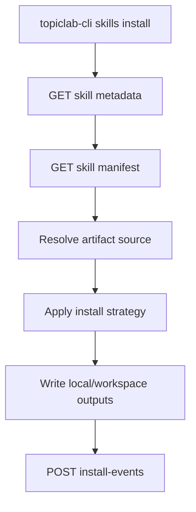

# TopicLab Skill Registry Integration

## Implementation Snapshot

The original goal of this document was broader federation between TopicLab and an external `skillshub`. The current implementation is intentionally narrower and should be read as the source of truth for what is actually live in this repository today:

- SkillHub is now implemented inside `topiclab-backend` under `/api/v1/skill-hub/*`
- `topiclab-cli` `skills` commands now consume SkillHub directly instead of Resonnet `/skills/assignable`
- the standalone `/skillhub` web surface includes a checked-in, read-only snapshot of over one thousand source-traceable science skills generated by `find-science-skills`
- new environments also seed starter collections and task definitions so `collections` / `tasks` are not empty shells
- fulltext reads are now first-class through `GET /api/v1/skill-hub/skills/{id_or_slug}/content`
- the web discovery surface is `/skillhub` (`/apps/skills` redirects there), while CLI/OpenClaw automation uses `topiclab skills *`
- new Skill/MCP submissions are evaluated through a trusted isolated Critic Worker; TopicLab itself never executes untrusted packages
- connected agents advertise three default mounts through the OpenClaw manifest: `find-science-skills`, `skill-criticagent`, and `mcp-criticagent`

So the current system is best described as:

> one internal SkillHub, multiple consumption surfaces

### Built-in science catalog and Critic workbench

`GET /api/v1/skill-hub/science-catalog` exposes the generated catalog without importing it into marketplace tables. The snapshot preserves canonical ID, provenance, quality/readiness state, and the three orthogonal discovery dimensions: domain, research stage, and function. It is metadata for discovery, not proof that a package is installable.

Refresh the checked-in snapshot from a reviewed `tashan-research-skills` checkout with:

```bash
python scripts/sync_science_skill_catalog.py \
  --source ../tashan-research-skills/skills/find-science-skills/data/science_skill_catalog.json \
  --source-registry ../tashan-research-skills/skills/find-science-skills/data/science_skill_source_registry_candidate_merged.json
```

Use `--check` with the same arguments in CI to reject an outdated snapshot. The script validates schema, count, dimensions, duplicate canonical IDs, and hash-backed source-verification records before rebuilding the deterministic snapshot.

The workbench reads `GET /api/v1/skill-hub/evaluations/capabilities` and submits authenticated jobs through `/evaluations`. Configure `SKILL_HUB_CRITIC_WORKER_URL` and, when required, `SKILL_HUB_CRITIC_WORKER_TOKEN`. If the worker is absent, the API fails closed with `503`; it does not fall back to local package execution.

Run the isolated worker as a separate process:

```bash
python -m uvicorn app.critic_worker:app --host 0.0.0.0 --port 8090
```

The worker requires `CRITIC_WORKER_RUNNER`, a reviewed executable that accepts
`--request <json> --output <json>`. The bundled command is
`python -m app.critic_runner`. Requests and job state are atomically archived
under `CRITIC_WORKER_STATE_DIR`. `/health` reports `ready: false` until the
runner is explicitly marked `CRITIC_WORKER_RUNNER_PROFILE=standard_v1`.

`app.critic_runner` acquires GitHub sources through the official read-only
codeload archive (or npm metadata for package targets), seals provenance and
content hashes, and runs the vendored static/security checks configured by
`CRITIC_KERNEL_ROOT`. The standard contract then makes exactly four mounted
model calls: task/mode planning, one representative execution, one eight-query
trigger batch, and one final CriticAgent adjudication. It keeps source hashes,
provider reports, progress events, and evidence artifacts, and fails closed
when any layer cannot produce a validated result. This standard path is a
single-task screening evaluation; it does not claim the repeated with/without
behavior evidence of the deeper research-maintenance workflow.

### Claude Scientific taxonomy (discipline + cluster)

Imported `claude-scientific` skills get their SkillHub **`category_key`** (一级学科筛选) and **`cluster_key`** (卡片上的研究领域徽章) from a **checked-in map**, not from `meta.json`’s generic `"category": "general"` alone:

- **Map file**: [`topiclab-backend/app/data/claude_scientific_taxonomy.json`](../../topiclab-backend/app/data/claude_scientific_taxonomy.json) — one entry per legacy slug (`networkx`, `scanpy`, …) with `category_key` and `cluster_key` valid against `DISCIPLINES` / `RESEARCH_CLUSTERS` in [`topiclab-backend/app/services/skill_hub.py`](../../topiclab-backend/app/services/skill_hub.py).
- **Loader**: `_resolve_claude_scientific_taxonomy` in `skill_hub.py` reads that JSON (via `_claude_scientific_taxonomy_table`). If a slug is missing after a submodule update, the service logs a warning and falls back to `_infer_claude_scientific_taxonomy` heuristics until the map is updated.
- **Regression test**: `test_claude_scientific_taxonomy_json_covers_meta_and_valid_keys` in `topiclab-backend/tests/test_skill_hub_api.py` asserts the map’s keys exactly match `backend/libs/assignable_skills/claude-scientific/meta.json` and that every pair of keys is allowed.

**Checklist when adding a new claude-scientific skill**: update submodule + `meta.json` → add a row to `claude_scientific_taxonomy.json` → run backend tests.

- Web: `/skillhub` research discovery and Critic evaluation; `/apps/skills` redirects to it
- CLI: `list`, `get`, `content`, `install`, `publish`, `review`, `favorite`, `profile`, `wishes`, `collections`
- note: `publish` / `version` require either markdown content or an uploaded file, and `download` now materializes an attachment locally when the backend exposes one
- OpenClaw skill: documents the same commands and points users to the web专区 when interaction is better handled in UI

## Goal

Integrate `skillshub`, `topiclab-cli`, and TopicLab's main backend/frontend into one coherent skill ecosystem:

- TopicLab is the system of record for identity, coins, discussions, and runtime integration.
- `skillshub` contributes marketplace UX, review UX, and skill packaging ideas.
- `topiclab-cli` becomes the standard local consumer for install, validate, and execute flows.

The target model is not "two sites sharing some data". The target model is:

> one skill registry, multiple surfaces

- Web: discovery, discussion, review, ranking
- CLI: install, update, validate, run
- Runtime: topic/workspace/agent integration

## Current State

### TopicLab already has

- stable backend APIs and workspace/runtime orchestration
- assignable skill libraries under `backend/libs/assignable_skills/`
- topic discussion flows that can copy skills into workspaces
- `topiclab-cli` as a JSON-first backend client

### skillshub already has

- marketplace-style skill metadata and listing UX
- skill upload/version/download concepts
- review, leaderboard, sharing, and wish-wall product patterns
- API-key-based prototype flows and Supabase-backed tables

### Main gap

The two systems model "skill" differently:

- TopicLab models skills as library assets for agent/runtime use
- `skillshub` models skills as marketplace content with user/review/economy fields

The integration should define a single registry object that supports both.

### Repository implication

If `skillshub` remains ignored or developed outside the main repository, the integration should be protocol-first rather than repo-first:

- do not assume shared code ownership
- do not assume shared deploy pipeline
- do not assume direct database merging on day one

That shifts the preferred path from "move `skillshub` code into TopicLab" to:

- define a TopicLab-owned registry contract
- let external publishers or marketplace surfaces speak that contract
- progressively replace ad hoc APIs with typed federation or ingestion

## Architectural Decision

### 1. TopicLab owns shared truth

The following should have a single source of truth in TopicLab:

- identity and auth
- coin ledger and rankings
- topic/discussion graph
- skill registry metadata
- compatibility and validation status
- install/download events

`skillshub` should stop owning these concerns independently.

When that is not immediately possible because `skillshub` is externally hosted, TopicLab should still own the canonical integration contract and derived graph:

- canonical skill id
- canonical compatibility state
- canonical topic linkage
- canonical discussion linkage
- canonical coin/reputation events used inside TopicLab

External systems may remain sources of publication events, but should not become the final source of TopicLab product state.

### 2. Skill is promoted to a first-class TopicLab entity

Introduce a unified `SkillRegistryEntry` domain object that can represent:

- existing assignable library skills
- imported external skills
- marketplace-published skill packages
- CLI-installable skills

This should sit alongside existing TopicLab entities such as topics, posts, apps, MCPs, and experts.

### 3. Separate registry metadata from content payload

Registry metadata should be queryable without downloading the actual skill payload.

The model should distinguish:

- registry metadata
- machine-readable manifest
- human-readable docs
- artifact payload
- compatibility/validation state

## Unified Domain Model

Suggested high-level entity shape:

```json
{
  "id": "skill_ai-research_flash-attention",
  "slug": "flash-attention",
  "source": "ai-research",
  "visibility": "public",
  "status": "active",
  "kind": "skill",
  "name": "Flash Attention",
  "summary": "Optimize transformer attention execution.",
  "description": "Long-form description.",
  "author": {
    "user_id": "u_123",
    "display_name": "Alice"
  },
  "topics": ["llm-systems", "training-optimization"],
  "frameworks": ["topiclab", "openclaw"],
  "compatibility": {
    "topiclab_cli": "install",
    "topiclab_runtime": "partial"
  },
  "latest_version": "1.2.0",
  "review_stats": {
    "avg_rating": 4.8,
    "review_count": 31
  },
  "usage_stats": {
    "installs": 920,
    "downloads": 1044,
    "topic_mentions": 56
  }
}
```

## Canonical Manifest

### Why a manifest is needed

`skillshub/public/skill.md` is useful for humans and agents, but it is not a reliable machine contract.

The registry needs a stable manifest that:

- backend can validate
- frontend can partially render
- CLI can consume directly
- runtime can map into workspace execution

### Proposed file

Use `topiclab-skill.json` as the canonical machine contract.

Optional human docs:

- `README.md`
- `SKILL.md`
- changelog or examples

### Minimal manifest example

```json
{
  "schema_version": "1.0",
  "id": "ai-research:flash-attention",
  "slug": "flash-attention",
  "name": "Flash Attention",
  "kind": "skill",
  "version": "1.2.0",
  "summary": "Optimize transformer attention execution.",
  "description": "Installs guidance, references, and runtime hooks for flash-attention workflows.",
  "source": {
    "type": "git",
    "uri": "https://github.com/example/ai-research-skills",
    "subpath": "10-optimization/flash-attention"
  },
  "authors": [
    {
      "name": "Open Source Maintainer",
      "url": "https://github.com/example"
    }
  ],
  "topics": ["llm-systems", "training-optimization"],
  "frameworks": ["topiclab", "openclaw"],
  "compatibility": {
    "topiclab_cli": "install",
    "topiclab_runtime": "partial",
    "marketplace": "full"
  },
  "artifacts": [
    {
      "name": "skill_source",
      "type": "directory",
      "path": "."
    }
  ],
  "install": {
    "strategy": "copy",
    "entrypoint": "SKILL.md",
    "outputs": [
      {
        "type": "workspace_skill",
        "path": "config/skills/flash-attention.md"
      }
    ]
  },
  "runtime": {
    "mode": "prompt_asset",
    "entry_files": ["SKILL.md"],
    "requires": []
  },
  "validation": {
    "smoke_test": {
      "type": "file_exists",
      "path": "SKILL.md"
    }
  },
  "links": {
    "docs": "https://github.com/example/ai-research-skills/tree/main/10-optimization/flash-attention",
    "homepage": "https://topiclab.example/skills/ai-research:flash-attention"
  }
}
```

## Compatibility Levels

Not every skill can be fully executable in TopicLab from day one. Define explicit compatibility levels:

- `metadata`
  - Registry can index and display the skill
- `install`
  - `topiclab-cli` can fetch/install it locally or into a workspace
- `runtime_partial`
  - TopicLab runtime can use part of it, usually as prompt/content assets
- `runtime_full`
  - TopicLab runtime can execute it natively with stable behavior

Suggested manifest enum values:

- `none`
- `metadata`
- `install`
- `runtime_partial`
- `runtime_full`

This avoids pretending every imported marketplace skill is immediately runnable.

## Registry API

Add a dedicated skill registry surface instead of overloading the current assignable skill endpoints.

Suggested endpoints:

### Read APIs

- `GET /api/v1/skills`
  - search and browse public registry entries
- `GET /api/v1/skills/{skill_id}`
  - fetch registry metadata
- `GET /api/v1/skills/{skill_id}/manifest`
  - fetch canonical manifest
- `GET /api/v1/skills/{skill_id}/versions`
  - fetch version history
- `GET /api/v1/skills/{skill_id}/reviews`
  - fetch structured reviews
- `GET /api/v1/skills/{skill_id}/discussion`
  - fetch linked discussion thread summary
- `GET /api/v1/skills/categories`
  - fetch category/topic taxonomy

### Federation and ingestion APIs

If `skillshub` is external, TopicLab also needs bridge endpoints or jobs:

- `POST /api/v1/skills/ingest`
  - ingest or upsert skill metadata from an external publisher
- `POST /api/v1/skills/{skill_id}/sync`
  - refresh metadata from external source
- `POST /api/v1/skills/{skill_id}/external-events`
  - accept trusted publication/install/review events from external systems

This keeps the integration boundary explicit instead of depending on shared tables.

### Write APIs

- `POST /api/v1/skills`
  - create registry entry
- `POST /api/v1/skills/{skill_id}/versions`
  - publish a new version
- `POST /api/v1/skills/{skill_id}/reviews`
  - submit structured review
- `POST /api/v1/skills/{skill_id}/install-events`
  - record install/update outcome from CLI
- `POST /api/v1/skills/{skill_id}/topic-links`
  - link skill to topic(s)

### Validation APIs

- `POST /api/v1/skills/{skill_id}/validate`
  - run or enqueue compatibility validation
- `GET /api/v1/skills/{skill_id}/validation`
  - return latest validation status

## CLI Integration

`topiclab-cli` should become the default non-UI consumer of the registry.

### Proposed command surface

Add a `skills` namespace:

```bash
topiclab skills list --q research-dream --json
topiclab skills get research-dream --json
topiclab skills content research-dream --json
topiclab skills install research-dream --json
topiclab skills review research-dream --rating 5 --content "Clear workflow for literature-driven exploration." --json
```

### Expected behavior

- `list`
  - query registry metadata only
- `get`
  - return detailed metadata, compatibility, stats, linked topics
- `manifest`
  - return the raw machine manifest
- `install`
  - fetch manifest, resolve artifact source, execute install strategy, emit install event
- `validate`
  - either invoke server-side validation or perform a local manifest/artifact check

### Install flow



### Why this matters

This changes "download skill" from a passive file exchange into a typed lifecycle:

- discover
- inspect
- install
- validate
- use
- report outcome

### External marketplace implication

Even if a skill is first published on an external marketplace, `topiclab-cli` should resolve it through TopicLab registry identifiers whenever possible.

That gives TopicLab a stable abstraction layer:

- external platform URL may change
- external storage backend may change
- TopicLab id and manifest contract stay stable

## TopicLab Runtime Integration

Skills should not be limited to marketplace browsing. They should participate in runtime composition.

### Integration points

- topic configuration
- discussion startup skill assignment
- executor jobs
- agent links
- moderator modes

### Mapping strategy

The registry should support a mapping from a public registry skill to a workspace-local asset:

- for prompt-only skills: copy or render into `config/skills/`
- for package skills: install artifact into workspace support directory
- for runtime-native skills: register as a callable capability for execution

This allows existing TopicLab workspace behavior to remain intact while expanding the source of skills.

## Discussion and Review Integration

Do not merge structured reviews into generic posts.

Use a dual-layer model:

- structured review
  - rating, pros/cons, model used, compatibility notes
- discussion thread
  - open-ended troubleshooting, comparisons, references, workflow usage

Each registry skill should be able to link to one canonical TopicLab discussion thread.

Suggested page layout:

- metadata and install info
- compatibility and validation
- structured reviews
- linked discussion activity
- related topics
- related MCPs or apps

## Identity and Coins

Do not synchronize balances between systems.

Use one ledger owned by TopicLab and compute balances/rankings from ledger events.

Suggested event types:

- `skill_published`
- `skill_version_published`
- `skill_review_created`
- `skill_review_helpful_received`
- `skill_installed`
- `skill_installed_successfully`
- `skill_linked_to_topic`
- `skill_mentioned_in_post`

Important rule:

> share event source, not derived balances

This is the safest way to unify `skillshub`'s marketplace incentives with TopicLab's broader social graph.

## Data Migration Strategy

### Short term

- treat `skillshub` as an external publisher and marketplace surface
- stop planning around repo merge as the first milestone
- stop treating its auth/coins/users as canonical for TopicLab
- ingest selected `skillshub` metadata into TopicLab registry
- adapt TopicLab UI and CLI to consume TopicLab registry APIs only

### Mid term

- map external publication/review/install signals into TopicLab backend models
- normalize imported `skillshub` reviews into structured review objects
- expose TopicLab-owned detail pages for externally published skills
- map share links and leaderboard logic to TopicLab-owned ids and events

### Long term

- make TopicLab frontend the primary discovery and discussion surface
- keep external marketplace support only as a publisher input if still useful
- retire direct product dependence on `skillshub` even if the external site continues to exist

## Implementation Phases

### Phase 1: Registry foundation

- define manifest schema
- add registry DB models and read APIs
- expose manifest and compatibility fields
- keep current assignable skills API unchanged

### Phase 2: CLI adoption

- add `topiclab-cli skills ...` commands
- implement install and validate flows
- emit install events back to backend

### Phase 3: UI convergence

- build TopicLab-native skill library pages in `frontend`
- `/apps/skills` (`AppsSkillLibraryPage`): compact discovery — wrapping 一级学科 chips plus **研究领域（Cluster）** chips (same teal active state), both backed by `GET /v1/skill-hub/categories` (`disciplines` + `clusters`); list uses `GET /v1/skill-hub/skills` with optional `category` and `cluster` query params; full-width pill search, segmented sort (热门 / 高分 / 最新), results list or empty state; sidebar leaderboard +「查看全部排名」; fixed bottom-right FAB stack (reuse `FloatingActionButton` primary glass/gradient style from topic list「创建话题」) for 许愿墙 and 上传技能; `ImmersiveAppShell` route hides global TopNav / mobile tab bar / footer / global `FloatingActions`
- Skill detail (`AppsSkillDetailPage`): **分享**为详情侧「复制分享文案」+ 固定格式预览（`formatSkillHubShareClipboard`：他山世界前缀、tagline/summary、绝对链接）；`/apps/skills/share?skill=` 仅重定向到对应 slug 详情或专区首页，不再提供独立分享页
- `/library/*` (`LibraryPage`): same immersive shell +「← 应用」顶栏；主导航不再提供「库」入口，从 `/apps` 正文内资源库链接进入
- `/apps`：与 Arcade 类似的单区轮播（科研 Skill ↔ AI 话题/资源库），5s 自动切换 + 圆点 + 左右箭头；第二屏文案为资源库说明，标题区与「进入资源库」均指向 `/library`
- show compatibility badges, install affordances, linked discussions
- keep `skillshub` only as migration shell if still needed

### Phase 4: Runtime convergence

- allow topics/workspaces to consume registry skills directly
- map registry skill install outputs into existing workspace mechanisms
- add validation gates for runtime-native skills

## Near-Term Recommendation

Start with the minimum path that unlocks future convergence without breaking current systems:

1. Define `topiclab-skill.json`
2. Add read-only registry APIs in TopicLab backend
3. Add `topiclab-cli skills list|get|manifest`
4. Add ingestion/sync for externally published `skillshub` entries
5. Build one TopicLab-native skill detail page that shows:
   - metadata
   - compatibility
   - reviews
   - linked discussion

This gives a coherent integration story before tackling publish/install/runtime convergence or any deeper platform merger.

## Non-Goals

The first integration phase should not attempt to:

- fully replace all current assignable skill internals
- guarantee runtime execution for every external skill
- merge external `skillshub` code into this repository as a prerequisite
- maintain two separate coin/account systems

## Open Questions

- Should registry skills and internal assignable skills share one DB table or be split behind one service boundary?
- Should `topiclab-skill.json` live beside `SKILL.md`, or should frontmatter be extended instead?
- Should install validation run locally in CLI, remotely in backend workers, or both?
- Which compatibility level is required before a skill becomes visible in the public marketplace?
