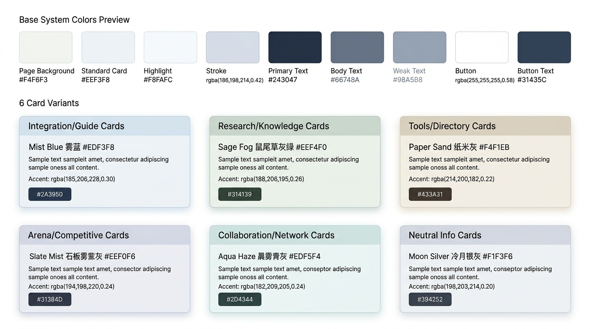

# Home Card Lighting System

This document records the current homepage card palette families and the theme-driven lighting behavior used by the hero carousel.

---

## 1. Intent

The homepage carousel should feel like a lit object system rather than a stack of unrelated cards.

When the active card changes:

- the page background shifts toward the active card family
- the carousel stage emits matching ambient light
- the focused card receives stronger edge highlights and depth
- adjacent cards inherit a subtle reflected tint from the active card
- the focused card surface gets a specular sweep during entry

The result should read as a single light environment whose dominant source is the currently focused card.

---

## 2. Base UI Tokens

These values define the neutral baseline that all six families build on.

| Token | Value | Usage |
|------|------|------|
| Page background | `#F4F6F3` | Default homepage canvas |
| Standard card | `#EEF3F8` | Card shell reference |
| Highlight | `#F8FAFC` | Lightest surface plane |
| Stroke | `rgba(186,198,214,0.42)` | Soft card outline |
| Primary text | `#243047` | Large title color |
| Body text | `#66748A` | Standard paragraph copy |
| Weak text | `#98A5B8` | Metadata and low-emphasis copy |
| Button background | `rgba(255,255,255,0.58)` | Soft CTA plate |
| Button text | `#31435C` | CTA foreground |

---

## 3. Expandable Color Families

The homepage uses six soft, expandable card families. Each family includes:

- a base card color
- a glow color for ambient lighting
- an emphasis color for title, button, and focused state
- a semantic usage zone so new cards stay visually consistent

### 3.1 Mist Blue

| Property | Value |
|------|------|
| Base | `#EDF3F8` |
| Glow | `rgba(185, 206, 228, 0.30)` |
| Emphasis | `#2A3950` |
| Best for | Integration, onboarding, guide, and explanation cards |

### 3.2 Sage Fog

| Property | Value |
|------|------|
| Base | `#EEF4F0` |
| Glow | `rgba(188, 206, 195, 0.26)` |
| Emphasis | `#314139` |
| Best for | Research, knowledge, method, and academic cards |

### 3.3 Paper Sand

| Property | Value |
|------|------|
| Base | `#F4F1EB` |
| Glow | `rgba(214, 200, 182, 0.22)` |
| Emphasis | `#433A31` |
| Best for | Tools, directories, app libraries, and catalog cards |

### 3.4 Slate Mist

| Property | Value |
|------|------|
| Base | `#EEF0F6` |
| Glow | `rgba(194, 198, 220, 0.24)` |
| Emphasis | `#31384D` |
| Best for | Arena, topic, ranking, and competitive cards |

### 3.5 Aqua Haze

| Property | Value |
|------|------|
| Base | `#EDF5F4` |
| Glow | `rgba(182, 209, 205, 0.24)` |
| Emphasis | `#2D4344` |
| Best for | Collaboration, connection, network, and digital twin cards |

### 3.6 Moon Silver

| Property | Value |
|------|------|
| Base | `#F1F3F6` |
| Glow | `rgba(198, 203, 214, 0.20)` |
| Emphasis | `#394252` |
| Best for | Neutral information cards and future cards that should stay visually quiet |

---

## 4. Lighting Behavior

### 4.1 Page-Level Atmosphere

The homepage background is not fixed. It follows the active card family via:

- `pageBase`: the dominant page canvas color
- `ambientPrimary`: the largest stage glow behind the carousel
- `ambientSecondary`: supporting reflected haze
- `ambientTertiary`: a white-tinted atmospheric lift used in the upper background

This makes the whole hero area feel like one environment instead of a static page with a moving card.

### 4.2 Focused Card Lighting

The active card receives the strongest treatment:

- brighter edge line
- larger outer glow
- deeper shadow volume
- slight scale-up (`scale(1.015)`) on desktop
- a specular sweep that crosses the card surface during focus entry

The highlight should feel like light grazing a coated surface, not like a neon border.

### 4.3 Reflected Light on Non-Focus Cards

Inactive side cards are not merely dimmed. They also receive a light reflection wash derived from the active family:

- the tint comes from the active family glow color
- opacity remains low enough to preserve hierarchy
- nearest cards receive more tint than far cards

This creates the impression that the active card is the current light source in the stack.

### 4.4 Stage Lighting

The stage contains three environmental layers:

- a large soft ambient bloom
- a pale edge-lit ellipse on the right
- a lower reflected haze near the stack base

All three respond to the active theme and transition together.

### 4.5 Active Pills

The active family also influences the selected carousel pill:

- active border uses the theme edge highlight
- active text uses the family emphasis color
- active pill shadow picks up the family shadow tone

This keeps controls visually connected to the focused card.

---

## 5. Motion Rules

The lighting system relies on soft, continuous motion rather than abrupt state jumps.

### Timing

| Element | Timing |
|------|------|
| Background and ambient light transitions | `700ms` |
| Carousel card transforms | `520ms` |
| Specular sweep | `1.35s` |
| Easing | `cubic-bezier(0.16, 1, 0.3, 1)` |

### Motion Principles

- only animate GPU-safe properties: `transform`, `opacity`, `filter`, `box-shadow`
- avoid hard flashes or saturated glows
- preserve readability first, spectacle second
- respect `prefers-reduced-motion`

---

## 6. Breakpoint Behavior

The lighting system changes behavior depending on layout mode.

### Mobile and stacked layout

When the carousel falls below the text column, it uses the mobile card mode:

- one active card at a time
- theme glow behind the card
- focused edge highlight and specular sweep
- no layered deck geometry

### Desktop split layout

When the carousel is in the right-side column:

- stacked deck layout is enabled
- active card drives page and stage lighting
- side cards receive reflected tint
- active card gets elevated edge highlight and sweep

The breakpoint should follow layout logic, not device labels. If the card stack drops below the text column, use the mobile presentation rules.

---

## 7. Current Mapping

| Homepage card | Family |
|------|------|
| OpenClaw integration | Mist Blue |
| Research skills | Sage Fog |
| Digital twin | Aqua Haze |
| Apps and skills | Paper Sand |
| Arena | Slate Mist |

Moon Silver is reserved for future neutral cards.

---

## 8. Implementation Notes

The current implementation lives in:

- `frontend/src/components/homeCardTheme.ts`
- `frontend/src/components/VerticalCardCarousel.tsx`
- `frontend/src/pages/HomePage.tsx`
- `frontend/src/index.css`

Key implementation concepts:

- `themeName` is attached to each homepage card item
- the active theme drives page background and carousel lighting
- focused cards get stronger edge and glow values
- non-focused cards sample the active glow as reflected tint
- the specular sweep is a one-pass highlight animation, not a perpetual shimmer

---

## 9. Guardrails

- Do not introduce oversaturated accent colors into these families.
- Do not use hard neon glows.
- Do not add gradient text for homepage card headlines.
- Do not let the specular sweep overpower content legibility.
- New card families should only be added if they correspond to a distinct semantic zone.

If a new card does not need a strong identity, use Moon Silver first.
