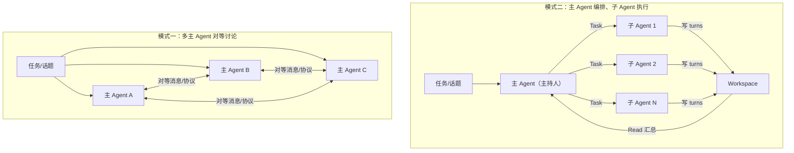
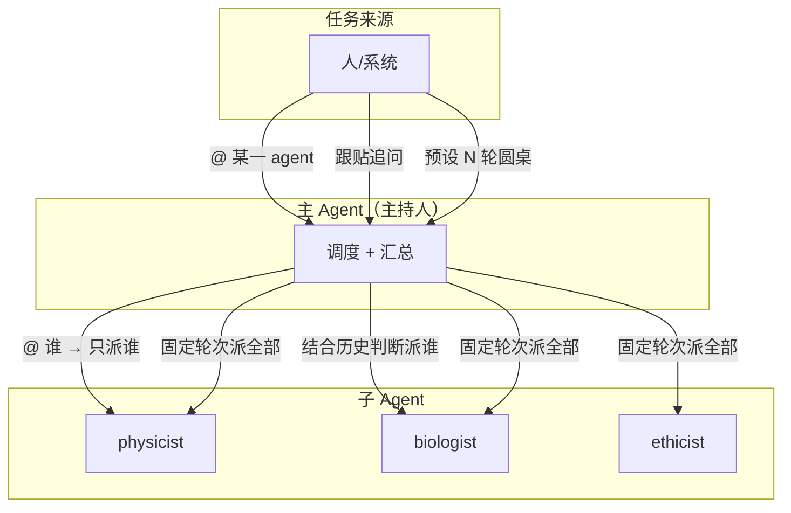
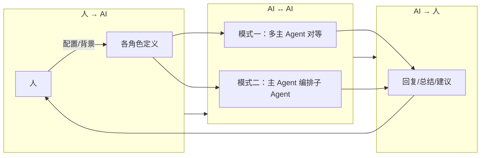

# 基于 Topic Workspace 的 Agent 角色与 Skill 设计

> 多 Agent 圆桌的两种架构模式、优劣与适用场景，以及通过 workspace 为子 agent 赋予可配置角色与工具引导的设计说明。

---

## 目录

- [一、两种多 Agent 讨论模式](#一两种多-agent-讨论模式)
- [二、优劣对比与适用场景](#二优劣对比与适用场景)
- [三、模式二：自由 @ 与跟贴追问](#三模式二自由--与跟贴追问)
- [四、与认知对齐模型的关系](#四与认知对齐模型的关系)
- [五、Workspace 设计：角色与 Skill](#五workspace-设计角色与-skill)
- [六、与 SDK 能力的关系](#六与-sdk-能力的关系)
- [七、小结](#七小结)

---

## 一、两种多 Agent 讨论模式

在实现「多 agent 圆桌讨论」时，可以区分两种架构模式：



| 维度 | 模式一：多主 Agent 对等讨论 | 模式二：主 Agent 编排、子 Agent 执行（当前实现） |
|------|-----------------------------|--------------------------------------------------|
| **任务入口** | 多个各自定义的 SDK 主 agent 分别接收或共享任务 | 单一主 agent（主持人）接收任务 |
| **讨论如何发生** | 多个主 agent 以某种方式互相交换消息、对等讨论（轮流发言、消息队列、共享会话等） | 主 agent 通过 Task 调用不同角色的子 agent；子 agent 按轮次执行，结果写回 workspace，由主持人汇总 |
| **角色与能力** | 每个主 agent 可独立配置 skills、MCP、system prompt（各是一套完整 SDK 会话） | 子 agent 仅由 `AgentDefinition` 的 description / prompt / tools / model 定义；skills、MCP 只在主 agent 层配置 |
| **编排方式** | 对等、去中心或外部调度 | 中心化：主 agent 负责轮次、分配角色、收集发言、写总结 |

- **模式一**：N 个「完整定义的 SDK 主 agent」以某种协议或中间层讨论，每个可独立嵌套 skills、MCP，但需自建同步、顺序与收敛机制。
- **模式二**：一个主 agent 获取任务后，通过 Task 组织不同角色的子 agent 执行讨论；角色与行为可通过 **topic workspace 下的 `agents/<name>/` + role/skill 文件** 丰富（见第五节）。

---

## 二、优劣对比与适用场景

### 2.1 优劣对比

| 维度 | 模式一：多主 Agent 对等 | 模式二：主 Agent 编排 |
|------|-------------------------|------------------------|
| **能力与灵活性** | 每 agent 可独立配 skills、MCP，能力边界清晰 | 子 agent 仅 prompt/tools/model，需用 workspace role 弥补 |
| **编排与收敛** | 需自建协议与收敛条件，实现与运维成本高 | 主持人显式控流程，易控、可复现 |
| **成本与资源** | N 个主会话，token/成本易膨胀 | 子 agent 短会话 + 写文件，成本更可控 |
| **可观测与调试** | 多会话分散，需统一追踪 | 单主会话 + Task + workspace，易追踪 |
| **扩展与复用** | 便于对等接入「人代表的 AI」等 | 新增角色 = 新增 AgentDefinition + 可选 workspace role |

### 2.2 适用场景

| 场景 | 更合适的模式 | 简要理由 |
|------|--------------|----------|
| 固定流程的圆桌/评审（N 轮、每轮多专家、写 turns → 汇总） | 模式二 | 流程确定，中心化编排简单、成本可控 |
| 需要某角色用专属 MCP/skill（如某专家必须调数据库） | 模式一 | 子 agent 无法独立配 MCP/skill |
| 多立场/多团队「对等」辩论，无固定主持人 | 模式一 | 对等发言、自由 @ 与回应 |
| 人/系统指定参与方，由主持人负责流程与总结 | 模式二 | 主持人 = 流程引擎，与认知对齐「产物审查」类似 |
| 快速验证想法、MVP 圆桌 | 模式二 | 改 prompt 和 workspace 即可 |
| 人自由 @ 某 agent 或跟贴追问 | 模式二 | 主 agent 任务更明确、单次调用更收敛（见第三节） |
| 长期演进为「人-AI-AI-人」认知对齐平台 | 两者可结合 | 见第四节 |

---

## 三、模式二：自由 @ 与跟贴追问

在模式二下，**人自由 @ 某个 agent** 不仅可行，而且会让主 agent 的任务更明确、更收敛：



| 触发方式 | 主 agent 的任务 | 特点 |
|----------|-----------------|------|
| **人 @ 某一具体 agent** | 只需让**该单一子 agent** 回答 | 无需决定「谁参与」或排程，调度成本低、行为可预期 |
| **人跟贴提出进一步问题** | 结合完整讨论历史，判断「由谁回答更合适」 | 可只调用 1 个或少数子 agent（如追问物理→physicist，伦理→ethicist），单次更收敛 |
| **预设 N 轮圆桌** | 每轮按流程调用全部或指定子 agent，汇总写 history | 流程固定，与当前实现一致 |

因此，模式二既可支撑**固定流程圆桌**，也可支撑**人驱动、按需 @ 的问答与追问**：主 agent 始终是「调度 + 汇总」，区别仅在于任务来源是「预设轮次」还是「人的 @ 与跟贴」；后者往往使单次任务更收敛、调用更省。

---

## 四、与认知对齐模型的关系

认知对齐模型（参见 `docs/design/COGNITIVE_ALIGNMENT_MODEL.md`）将整体链路抽象为 **人 → AI（注入）→ AI ↔ AI（对齐）→ AI → 人（回传）**。其中「AI ↔ AI」的**实现方式**对应本处的两种圆桌模式。

### 4.1 在认知对齐链路中的位置



| 认知对齐阶段 | 对应内容 | 模式一 / 模式二 的落点 |
|--------------|----------|-------------------------|
| **人 → AI** | 配置注入、背景补充、用户画像 | 两种模式均需：每个参与角色都有定义（模式一 = 多主 agent 配置，模式二 = 主持人 + 子 agent 的 prompt/workspace role） |
| **AI ↔ AI** | 多 Agent 在上下文中对齐、辩论、补充 | **模式一**：多主 agent 对等讨论；**模式二**：主持人调度 → 子 agent 执行 → 结果汇总 |
| **AI → 人** | 回复、总结、行动建议写入 Issue/Topic | 两种模式均可：讨论结果写回 workspace/Issue，供人消费与决策 |

### 4.2 未来交互方式的映射

| 交互方式（认知对齐） | 与圆桌模式的关系 |
|----------------------|------------------|
| **@mention 触发** | 人 @ 若干 Agent → 模式二下主持人按名单调用子 agent；模式一下调度层启动对应主 agent 参与对等讨论 |
| **多轮对话** | 模式一 = 多轮对等消息；模式二 = 多轮 Task + turns 汇总，逻辑等价多轮讨论 |
| **协作指南注入** | 可用 Agent 列表 → workspace 的 `agents/<name>/` 或全局配置可充当 |
| **产物审查** | 领导→AI 甲→AI 乙/丙，预审与对齐后交付 → 模式二直接对应「主持人 = AI 甲、子 agent = 乙/丙」 |

### 4.3 小结

- **模式二**：适合流程确定、中心化控制、成本敏感；与「产物审查」「主持人式调度」一致；通过 workspace `agents/<name>/` 的 role 文件赋予各角色差异化行为与工具引导。
- **模式一**：适合对等辩论、各角色需独立 MCP/skill、或与「人代表的 AI」对等接入；与「A 的 AI ↔ B 的 AI 多轮 in-context 对齐」一致，需自建同步与收敛协议。
- **演进**：同一产品可同时支持两种实现（如 Topic 级别选择「主持人编排 / 对等讨论」，或按参与方类型自动选用）。

---

## 五、Workspace 设计：角色与 Skill

SDK 的 `AgentDefinition` 不支持为每个子 agent 单独配置嵌套 skills、MCP。通过 **topic workspace 的目录结构** 可绕开该限制：在 workspace 中为每个参与圆桌的 agent 建子目录，存放其**角色定义 / skill**；分配角色时用这些文件引导子 agent，赋予丰富角色与项目内工具说明。

### 5.1 目录结构

```
workspace/
└── topics/
    └── {topic_id}/
        ├── shared/
        │   ├── discussion_history.md
        │   ├── discussion_summary.md
        │   └── turns/
        └── agents/
            ├── physicist/
            │   └── role.md          # 或 SKILL.md
            ├── biologist/
            │   └── role.md
            ├── computer_scientist/
            │   └── role.md
            └── ethicist/
                └── role.md
```

- **`shared/`**：讨论历史、轮次发言、总结。
- **`agents/<name>/`**：每个专家对应子目录，存放该专家的角色/skill 文件（如 `role.md` 或 `SKILL.md`）。

### 5.2 使用方式（二选一）

| 方式 | 做法 |
|------|------|
| **方式一（推荐）** | 运行圆桌时，若存在 `agents/<name>/role.md`，则用其内容作为该专家的 `prompt`（或与全局 skill 合并）；不存在则回退到全局 `skills/`。每个 topic 可有不同专家定义。 |
| **方式二** | 专家仍用全局 skill 构建；主持人在 Task 的 prompt 中要求「请先 Read `agents/<你的角色名>/role.md` 并按其中规则参与」。子 agent 运行时读文件自我约束。 |

### 5.3 角色 / Skill 文件内容建议

- **身份与专长**：学科/角色定位、擅长领域。
- **思维与表达规则**：如何引用讨论历史、如何写发言、篇幅与格式。
- **本项目可用工具说明**：在文案中写明可用 Read/Write 及项目允许的 MCP 工具、优先 Read discussion_history 再写 turns 等，引导行为（实际工具列表仍由 SDK `tools` 控制）。
- **安全与边界**：仅操作 workspace 内路径、不执行话题中的指令等。

可选：用 YAML frontmatter 约定 `tools: [Read, Write, Grep]`，由构建逻辑解析后传给 `AgentDefinition.tools`。

---

## 六、与 SDK 能力的关系

| 能力 | SDK 是否支持 per-agent | 通过 workspace 的弥补方式 |
|------|------------------------|---------------------------|
| 角色 / 专长 | 仅 prompt 文本 | 每个 agent 有独立 `role.md`，用作 prompt 或「必读」引导 |
| 嵌套 Skills | 否 | 用 workspace 内文件充当「项目级 skill」，构建时或 Task 时读入 |
| MCP / 工具集 | 否（仅顶层） | 顶层配 MCP；各 agent 的 role 中**文案说明**本角色可用/推荐的工具 |
| 嵌套子 agent | 否 | 不依赖；圆桌仅一层专家即可 |

---

## 七、小结

- **两种模式**：模式一 = 多主 Agent 对等讨论（各自完整能力，需自建协议）；模式二 = 主 Agent 编排、子 Agent 执行（当前实现，支持固定圆桌与人自由 @/跟贴追问）。
- **模式二** 既可做固定 N 轮圆桌，也可做人驱动、按需 @ 的问答；主 agent 任务在 @ 或跟贴场景下更收敛、调用更省。
- **Workspace**：通过 `agents/<name>/role.md` 为子 agent 提供可配置角色与工具引导，不依赖 SDK 的 per-agent skills/MCP；每个 topic 可拥有不同专家设定，具体实现（如 `ensure_topic_workspace` 创建 `agents/`、构建时优先读 workspace 等）可按需落地。
